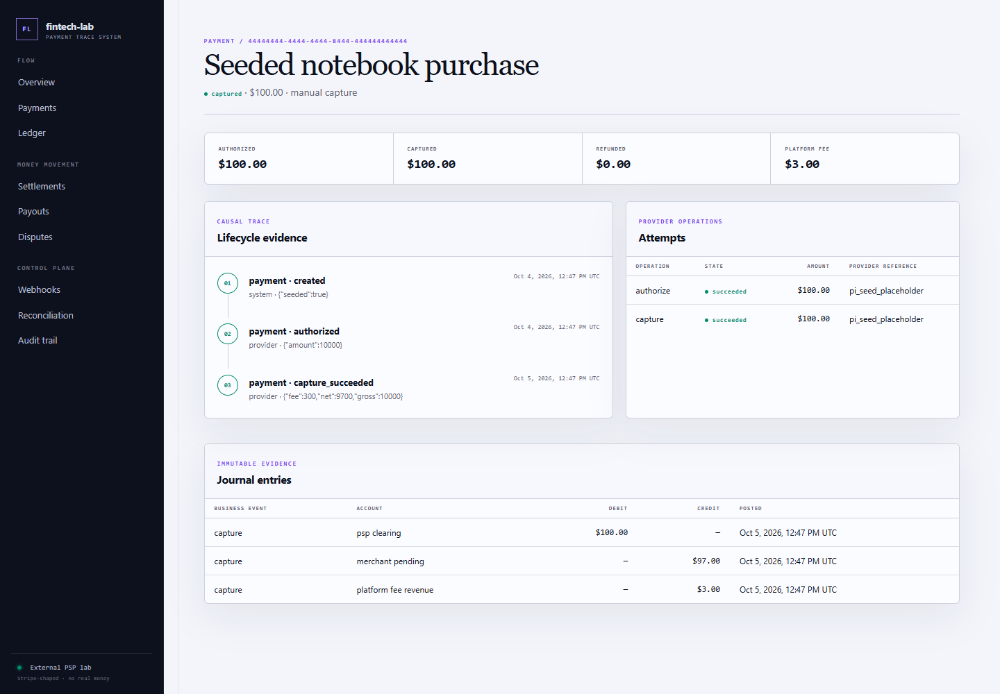

# Fintech Lab — Payment Correctness & Failure Recovery

[](https://github.com/daniel-tsx/fintech/actions/workflows/ci.yml)

A merchant payment-platform case study in **durable intent, asynchronous provider execution, and immutable accounting**. NestJS and PostgreSQL model authorization, capture, refunds, settlement and payout; a Next.js dashboard exposes the evidence behind each boundary.

The engineering focus is payment correctness under retries, duplicates, concurrency and uncertain outcomes. No real money moves in the verified exercises. No card collection or bank integration is implemented.

## What this project demonstrates

- **Atomic intent acceptance:** payment state, attempt, outbox command, audit and API replay response commit together.
- **Separate financial evidence:** signed webhook processing validates capture identity/amount/currency and posts a balanced journal; a synchronous provider response records references only.
- **Database-enforced effects:** deferred ledger balance checks, immutable journals/audit rows, unique business references, payment row locks and payout advisory locks.
- **At-least-once work:** outbox publication leases, RabbitMQ confirms/manual ACK/retry/dead letters, stable provider keys, durable webhook inbox and bounded prerequisite retries.
- **Inspectable money flow:** pending versus available merchant liabilities, proportional partial-refund fee allocation, dispute journals, internal settlement/payout and reconciliation issues.

The current `outbox-rabbitmq` branch uses a **Stripe SDK adapter** behind `PaymentProvider`. The deterministic Mock PSP was replaced in parent commit `286c8c3`; its original implementation remains in Git history at `4f1cf61`. Stripe and broker network boundaries are mocked in tests, and no external PSP exercise is claimed.

## Architecture

```mermaid
flowchart LR
  M[Merchant] --> API[NestJS API]
  API -->|atomic intent and command| DB[(PostgreSQL)]
  DB --> O[Transactional outbox]
  O --> Relay[Relay]
  Relay -->|publisher confirm| Q[(RabbitMQ)]
  Q -->|delivery and ACK| C[Command consumer]
  C --> Port[PaymentProvider port]
  Port --> PSP[Stripe SDK / HTTPS]
  PSP -->|signed event| I[Durable webhook inbox]
  I --> Apply[Webhook business transaction]
  Apply --> State[Payment state]
  Apply --> Ledger[Immutable double-entry ledger]
  Ledger --> S[Internal settlement]
  S --> A[Available merchant balance]
  A --> P[Internal payout]
  DB -->|API reads| UI[Next.js inspection dashboard]
  W[BullMQ scheduled worker] -. polls .-> I
  W -. schedules .-> S
  W -. internal payout work .-> P
  R[(Redis)] -. scheduling only .-> W
```



PostgreSQL owns durable internal state and financial effects. RabbitMQ delivers provider commands; Redis/BullMQ schedules inbox, settlement, reconciliation and internal payout work. Neither queue is the financial authority. Stripe owns external execution; the local provider table is a reference mirror.

See [architecture and module boundaries](docs/architecture.md) and [capture transaction boundaries](docs/payment-lifecycle.md).

## Core payment lifecycle and money flow

Authorization reserves provider funding capacity; it creates no local capture journal. Capture acceptance returns `202 CAPTURE_PENDING` after committing intent. A verified webhook later completes the attempt/payment and capture journal in one transaction.

For a USD 100.00 capture with a USD 3.00 platform fee:

| Boundary | Ledger movement | Merchant funds |
| --- | --- | --- |
| Capture webhook | Debit PSP clearing 100.00; credit merchant pending 97.00 and fee revenue 3.00 | Pending 97.00 |
| Internal settlement | Debit cash / credit PSP clearing 100.00; debit pending / credit available 97.00 | Available 97.00 |
| Payout reservation | Debit available / credit payout clearing 97.00 | Available consumed |
| Internal payout completion | Debit payout clearing / credit cash 97.00 | Lab payout succeeded |

All amounts are stored in integer minor units. Settlement and payout completion are **local accounting simulations**, not Stripe balance settlement or bank transfers. Refunds/disputes use compensating journals; posted history is not edited.



*Local fixture: a seeded capture and journal, not evidence of a live PSP transaction. [Capture details and reproduction](docs/assets/README.md).*

## Reliability and correctness boundaries

- **Payment state ≠ ledger state.** Workflow status and accounting answer different questions.
- **Captured ≠ settled; settled ≠ paid out.** Each boundary has its own records and postings.
- **Provider response ≠ local financial completion.** The consumer persists references before ACK; webhook processing owns capture finalization.
- **API replay ≠ queue deduplication.** PostgreSQL scopes idempotency records by merchant/operation/key and rejects a changed payload. Provider retries reuse the original command key.
- **Publication ≠ execution.** `outbox_events.PUBLISHED` means broker confirmation for provider commands. A crash before recording that mark can cause duplicate publication.
- **At-least-once is expected.** Uniqueness, locks and idempotency protect selected durable effects; exactly-once delivery is not claimed.

Missing webhook prerequisites retry; invalid domain transitions can dead-letter. Every out-of-order/stale-worker interleaving has not been proven. [Concurrency coverage](docs/concurrency.md) names tested races and remaining gaps.

## Failure simulation

The current checkout uses unit fixtures rather than runtime scenario switches:

| Exercise | Evidence |
| --- | --- |
| Broker unavailable or publication mark lost | [Outbox relay tests](apps/api/test/unit/outbox-relay.service.spec.ts) |
| Provider response lost; duplicate command/key reuse | [Stripe adapter](apps/api/test/unit/stripe-payment.provider.spec.ts), [consumer](apps/api/test/unit/payment-command.consumer.spec.ts), [handler tests](apps/api/test/unit/payment-command-handler.spec.ts) |
| Retry/DLQ confirm fails before ACK | [RabbitMQ adapter tests](apps/api/test/unit/rabbitmq.service.spec.ts) |
| Duplicate signed receipt, conflicting payouts/refunds | [PostgreSQL integration suite](apps/api/test/integration/financial-concurrency.spec.ts) |
| Provider captured while local capture is pending | [Reconciliation tests](apps/api/test/unit/reconciliation.service.spec.ts) |

`pnpm --filter @fintech-lab/api test:unit` runs the mocked exercises. Reconciliation detects drift for known provider references and records review issues; it does not automatically repair state or journals. See [current recovery limits](docs/failure-recovery.md) and the [historical Mock PSP catalog](docs/archive/failure-scenarios.md).

## Repository structure

```text
apps/api/
  src/                    domain modules, API and worker entry points
  drizzle/                checked-in SQL, financial triggers and migration metadata
  test/unit/              state, accounting, provider and messaging fixtures
  test/integration/       opt-in PostgreSQL financial/concurrency suite
apps/web/
  app/                    payment, ledger, inbox, settlement and audit inspection
  components/             evidence panes, tables and trace rails
docs/                     domain references, workflow, verification and assets
.github/workflows/ci.yml   Node checks and PostgreSQL integration job
```

GitHub repository slug: `fintech`. Workspace/application name: `fintech-lab`. Package filters: `@fintech-lab/api` and `@fintech-lab/web`.

## Tech stack

TypeScript · NestJS 11 · PostgreSQL · Drizzle ORM/SQL migrations · RabbitMQ/amqplib · Redis/BullMQ · Stripe SDK · Next.js 15/React 19 · Jest/ts-jest · pnpm workspace.

## Verification status

Local checks on **2026-10-07**, Node 24.19.0 / pnpm 10.26.0:

- Frozen install, lint, typecheck and Nest/Next production builds passed.
- **34 unit tests** passed; default tests deliberately skipped the five database cases.
- **5 PostgreSQL integration tests** passed with migrations on an isolated PostgreSQL **18** cluster.
- Seeded API/dashboard inspection is separate from provider execution. The web test script is a notice, not a browser suite.

CI is configured for Node 22/24 checks and a fresh PostgreSQL **17** integration service. No hosted CI run or Docker/Redis/RabbitMQ/Stripe network exercise was performed in this pass. The badge reports GitHub's workflow state when available.

[Exact commands, evidence, environment workarounds and gaps](docs/verification.md).

## Quick start

Requires Node ≥22, pnpm 10.26.0 and Docker Compose (or a disposable local PostgreSQL instance).

```bash
pnpm install --frozen-lockfile
cp .env.example apps/api/.env
docker compose up -d --wait
pnpm db:migrate
pnpm db:seed
```

On Command Prompt use `copy .env.example apps\api\.env`. Run `pnpm dev:api` and `pnpm dev:web` in separate terminals, then open [the seeded payment trace](http://localhost:3000/payments/44444444-4444-4444-8444-444444444444). The API exposes [Swagger](http://localhost:4000/docs).

Seeded inspection needs PostgreSQL only. Redis supports `dev:worker`; RabbitMQ is separately required for `dev:relay` and `dev:payment-consumer` and is not provided by Compose. Placeholder credentials cannot execute provider commands. The worker also schedules external reconciliation, so it is not part of the offline inspection quick start.

[Full setup, environment placement, test commands and offline demos](docs/verification.md).

## AI-assisted engineering workflow

AI tools support code inspection, changes and verification; financial claims must remain traceable to code or executed tests. [AGENTS.md](AGENTS.md) defines invariant/safety rules, [CLAUDE.md](CLAUDE.md) is a thin entry point, and the [task reading matrix](docs/AGENT_START_HERE.md) routes changes to relevant domain references.

The [workflow](docs/AI_WORKFLOW.md) requires an explicit invariant, a surgical diff, appropriate verification and an honest handoff. Mock tests are not evidence of a live payment integration.

## Documentation map

| Area | Start here |
| --- | --- |
| Architecture/correctness | [Architecture](docs/architecture.md), [database](docs/database-design.md), [ledger](docs/ledger.md), [concurrency](docs/concurrency.md) |
| Payment flows | [Lifecycle](docs/payment-lifecycle.md), [refunds/disputes](docs/refunds-and-disputes.md), [settlement/payout](docs/settlement-and-payout.md) |
| Reliability/provider boundary | [Webhooks/idempotency](docs/webhooks-and-idempotency.md), [outbox/RabbitMQ](docs/outbox-rabbitmq.md), [Stripe](docs/real-psp-stripe.md), [failure recovery](docs/failure-recovery.md), [reconciliation](docs/reconciliation.md) |
| Operations/security | [Verification](docs/verification.md), [observability](docs/observability.md), [security](docs/security.md) |

The [documentation index](docs/README.md) identifies ownership, historical material and task routing.

## Scope and intentional limitations

This is a local engineering reference. No deployment, real-money validation, compliance certification, PCI readiness, KYC/AML, checkout/card collection, customer authentication flow, provider settlement/report ingestion, real payouts, FX or bank rails is included.

Partial capture is modeled internally; Stripe multicapture depends on account/payment-method support and has not been externally verified. Cancellation records local `CANCELLED` before provider confirmation. Missing provider references require operator recovery; there is no automated financial repair or DLQ replay UI.

The development user-header fallback and public demo credentials are local study conveniences. Security controls need human review before broader use. No license is selected; repository licensing remains an owner decision.
