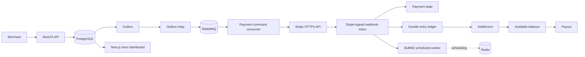

# fintech-lab

`fintech-lab` is a merchant payment-platform learning project. On the `outbox-rabbitmq` branch it is a NestJS modular monolith with a PostgreSQL transactional outbox relay, RabbitMQ provider-command consumers, a production-shaped Stripe adapter, durable webhook inbox, double-entry ledger, BullMQ scheduled work, settlement/payout workflows, reconciliation, and a Next.js inspection dashboard.

No real money moves. No raw card number, CVV, or bank credential is accepted or stored.

## System map



The important separations are enforced in code: payment state is not ledger state; captured is not settled; settled is not paid out; a provider response is not the platform's source of truth; and retries are safe only where PostgreSQL idempotency/uniqueness protects the effect.

## Modules

- Auth and merchant tenancy: API-key hash lookup, roles, and development users.
- Payments: strict authorization/capture state machine and partial capture.
- Payment Provider: interface token plus official-SDK Stripe adapter.
- Webhooks: Stripe raw-body signature verification, normalization, durable inbox, duplicate and out-of-order handling.
- Ledger and balances: immutable, database-balanced journals; pending/available derived from entries.
- Refunds and disputes: partial/full refund limits and compensating journals.
- Settlements and payouts: T+N grouping, availability, advisory-lock payout reservation.
- Outbox, relay, and messaging: crash-safe intent publication, publisher confirms, RabbitMQ ACK/retry/DLQ, leases, and duplicate-safe provider execution.
- Reconciliation: provider/internal comparison and explicit issue resolution.
- Audit and observability: immutable action log, correlation IDs, JSON logs, local metrics.

## Prerequisites

- Node.js 22 or newer (verified with Node 24)
- pnpm 10
- PostgreSQL 17 and Redis 7 for the full local application; RabbitMQ is optional and needed only for manually running the relay/consumer path

## Start locally

```bash
pnpm install
docker compose up -d
pnpm db:migrate
pnpm db:seed
```

Run these in separate terminals:

```bash
pnpm dev:api
pnpm dev:worker
pnpm dev:relay
pnpm dev:payment-consumer
pnpm dev:web
```

- Dashboard: `http://localhost:3000`
- API: `http://localhost:4000/api/v1`
- Swagger: `http://localhost:4000/docs`
- Health: `http://localhost:4000/api/v1/health`
- Metrics: `http://localhost:4000/api/v1/metrics`

The seed prints the demo identities and API key. Defaults also live in `.env.example`; the seeded merchant key is intentionally local-only.

## Local study mode

The checked-in Stripe and RabbitMQ values are local placeholders. Builds and automated tests do not make broker or Stripe network calls. Running the relay/consumer against a real broker or executing a real provider command is intentionally outside automated verification; use the mocked tests to study the lifecycle.

An API intent can still be created for inspecting the local outbox transaction:

```bash
curl -X POST http://localhost:4000/api/v1/payments \
  -H "x-api-key: fl_test_demo_6f414a845fe04eb4" \
  -H "Idempotency-Key: order-2026-001" \
  -H "Content-Type: application/json" \
  -d '{"amount":10000,"currency":"USD","paymentMethodToken":"pm_test_placeholder","captureMethod":"MANUAL"}'
```

## Database and migrations

The Drizzle schema is in `apps/api/src/database/schema.ts`. Checked-in SQL lives in `apps/api/drizzle/`. The initial migration adds protections Drizzle cannot express directly: a deferred balance trigger, immutable ledger/audit triggers, protected webhook evidence, platform/merchant account uniqueness, and missing self/cross references.

```bash
pnpm db:generate  # only after intentional schema changes
pnpm db:migrate
pnpm db:seed
```

Do not regenerate the initial migration without preserving its hand-authored financial triggers.

## Tests and checks

```bash
pnpm lint
pnpm typecheck
pnpm test
pnpm build
```

Database race tests are opt-in so unit tests do not silently depend on local infrastructure:

```bash
RUN_DB_TESTS=1 pnpm --filter @fintech-lab/api test:integration
```

On PowerShell use `$env:RUN_DB_TESTS='1'` first. The integration suite proves deferred ledger balance rejection, concurrent payout reservation, concurrent refund limits, signed Stripe webhook deduplication, and webhook-driven capture completion against PostgreSQL. No Stripe network call is made.

## Learning map

| Concept | Start here |
| --- | --- |
| System boundaries | `docs/architecture.md`, `apps/api/src/app.module.ts` |
| Authorization/capture | `apps/api/src/payments/payment-state.machine.ts`, `payments.service.ts` |
| Mock-to-Stripe differences | `docs/real-psp-stripe.md` |
| Polling-to-RabbitMQ differences | `docs/outbox-rabbitmq.md` |
| Provider abstraction | `apps/api/src/payment-provider/payment-provider.types.ts`, `stripe-payment.provider.ts` |
| API idempotency | `apps/api/src/common/idempotency.service.ts`, `docs/webhooks-and-idempotency.md` |
| Transactional outbox relay | `apps/api/src/outbox/outbox.service.ts`, `outbox-relay.service.ts` |
| RabbitMQ consumer | `apps/api/src/rabbitmq/rabbitmq.service.ts`, `apps/api/src/payment-commands/payment-command.consumer.ts` |
| Webhook inbox | `apps/api/src/webhooks/webhook-receiver.service.ts`, `webhook-processor.service.ts` |
| Double-entry ledger | `apps/api/src/ledger/ledger.service.ts`, `docs/ledger.md` |
| Database invariants | `apps/api/drizzle/0000_cheerful_sunset_bain.sql` |
| Refund accounting | `apps/api/src/refunds/refunds.service.ts` |
| Dispute holds | `apps/api/src/disputes/disputes.service.ts` |
| Settlement | `apps/api/src/settlements/settlements.service.ts` |
| Payout concurrency | `apps/api/src/payouts/payouts.service.ts`, `docs/concurrency.md` |
| Reconciliation | `apps/api/src/reconciliation/reconciliation.service.ts` |
| Stripe event translation | `apps/api/src/webhooks/stripe-event.normalizer.ts` |
| End-to-end visual trace | `apps/web/app/payments/[id]/page.tsx` |

## Intentional simplifications

Stripe owns provider execution; `provider_transactions` is only a local reference mirror. RabbitMQ is not provisioned or deployed by this branch. Real credentials, live calls, interactive customer authentication, key rotation UI, KYC/AML, card collection, provider settlement ingestion, real payouts, deployment, reserves, multi-region processing, FX, and bank rails are out of scope. See `docs/outbox-rabbitmq.md` and `docs/real-psp-stripe.md`.

Security and legal/compliance notes are educational templates requiring human review; this repository makes no production-readiness or compliance claim.
