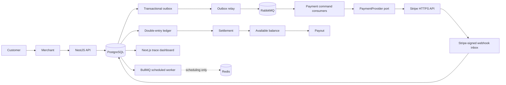

# Architecture

Status: current.

`fintech-lab` is a modular monolith with an external Stripe provider boundary on this learning branch. The HTTP API accepts merchant intent, PostgreSQL commits business state plus outbox messages, an outbox relay confirm-publishes provider commands to RabbitMQ, and dedicated consumers call Stripe. Redis/BullMQ remains only for scheduled webhook, settlement, reconciliation, and internal payout work. PostgreSQL remains the durable internal correctness boundary.

## Runtime units

- `apps/api`: NestJS modular monolith and Swagger API.
- `apps/api/src/worker.ts`: a separate Nest application context for BullMQ-scheduled webhook, settlement, reconciliation, and internal payout work.
- `apps/api/src/outbox-relay.ts`: a separate Nest application context that transfers committed provider outbox rows to RabbitMQ.
- `apps/api/src/payment-command-worker.ts`: a separate Nest application context consuming RabbitMQ provider commands.
- `apps/web`: Next.js App Router inspection UI. Server Components read the API; they do not access the database directly, preserving the educational API boundary.
- PostgreSQL: operational state, inbox/outbox, audit records, local provider-reference mirrors, ledger, and projections.
- RabbitMQ: provider-command delivery, competing consumers, acknowledgements, delayed retries, and dead letters; it is not the transactional source of truth.
- Redis: BullMQ scheduled coordination only; it is not in the provider-command path.

## Module boundaries

`payments` owns the payment aggregate and legal transitions. `payment-provider` defines the port and Stripe adapter. `webhooks` owns signed receipt, normalization, durable storage, and dispatch. `ledger` alone posts immutable journals. `settlements`, `payouts`, `refunds`, and `disputes` own their workflows. `reconciliation` detects disagreement but does not silently repair it. `auth` establishes merchant/role context. `audit`, `outbox`, `jobs`, and `observability` are supporting modules.

## Important decisions

1. Provider calls never mutate the ledger directly. A signed provider event is persisted, then processed idempotently.
2. A synchronous API response acknowledges accepted local intent, not final provider outcome.
3. A lost provider response is an unknown outcome. Consumers retry the original provider key; a webhook can independently complete capture. Reconciliation detects drift for known references but does not repair financial state.
4. Financial postings are double-entry, immutable, currency-isolated, and connected to an idempotent business reference.
5. Stripe owns provider execution and is accessed only through the `PaymentProvider` interface. Local provider rows are references/caches, never provider truth.

## Learning-branch limits

This is a local reference implementation. Provider and broker network behavior is mocked in automated tests; internal settlement and payout do not move external funds. Customer confirmation UI, provider settlement ingestion, managed secrets and deployment are outside scope. See [outbox delivery](outbox-rabbitmq.md), [Stripe boundary](real-psp-stripe.md) and [verification](verification.md).
