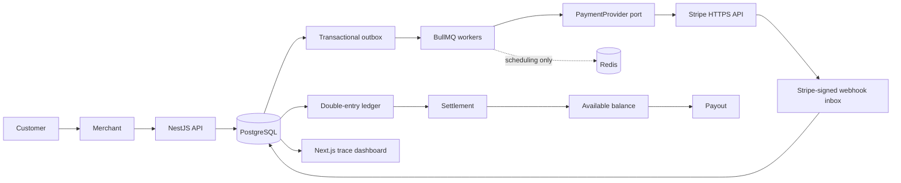

# Architecture

Status: current.

`fintech-lab` is a modular monolith with an external Stripe provider boundary on this learning branch. The HTTP API accepts merchant intent, PostgreSQL commits business state plus outbox messages, and workers perform provider, webhook, settlement, payout, and reconciliation work. Redis/BullMQ improves scheduling and retry ergonomics; PostgreSQL remains the durable internal correctness boundary.

## Runtime units

- `apps/api`: NestJS modular monolith and Swagger API.
- `apps/api/src/worker.ts`: a separate Nest application context running processors and polling safety nets.
- `apps/web`: Next.js App Router inspection UI. Server Components read the API; they do not access the database directly, preserving the educational API boundary.
- PostgreSQL: operational state, inbox/outbox, audit records, local provider-reference mirrors, ledger, and projections.
- Redis: BullMQ queue state only. Losing Redis delays work; it cannot duplicate a committed financial operation because consumers re-check PostgreSQL.

## Module boundaries

`payments` owns the payment aggregate and legal transitions. `payment-provider` defines the port and Stripe adapter. `webhooks` owns signed receipt, normalization, durable storage, and dispatch. `ledger` alone posts immutable journals. `settlements`, `payouts`, `refunds`, and `disputes` own their workflows. `reconciliation` detects disagreement but does not silently repair it. `auth` establishes merchant/role context. `audit`, `outbox`, `jobs`, and `observability` are supporting modules.

## Important decisions

1. Provider calls never mutate the ledger directly. A signed provider event is persisted, then processed idempotently.
2. A synchronous API response acknowledges accepted local intent, not final provider outcome.
3. Provider `processed-but-response-lost` is an unknown outcome and must be resolved by webhook or reconciliation, never blind retry.
4. Financial postings are double-entry, immutable, currency-isolated, and connected to an idempotent business reference.
5. Stripe owns provider execution and is accessed only through the `PaymentProvider` interface. Local provider rows are references/caches, never provider truth.

## Learning-branch limits

This code is production-shaped but intentionally not production-ready: no live credentials, customer confirmation UI, provider settlement ingestion, secret vault, or deployment is included. See `real-psp-stripe.md`.
