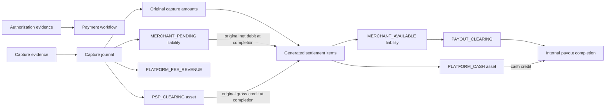
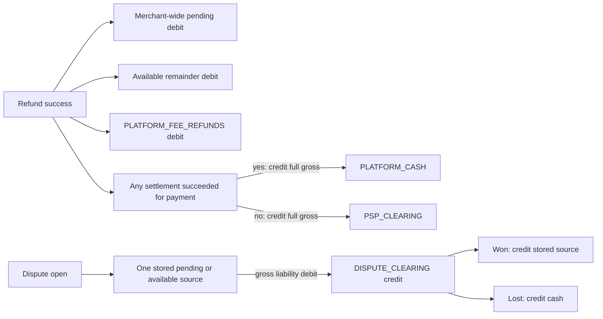

# H1 Fix 02: settlement accounting design

Status: planned runtime; Approach A approved for B1. Owner: F01 accounting design and regression contract. Date: 2026-10-09.

Sections 1–15 preserve **Run A** proposals and its original evidence. The subsequent human approval is recorded in section 16; the [B1 checkpoint](h1-fix-02-b1-allocation-foundation.md) installs a dormant schema/helper foundation. Runtime integration remains pending. [Settlement and payout](../settlement-and-payout.md), [Refunds and disputes](../refunds-and-disputes.md), [Ledger](../ledger.md), [Database design](../database-design.md) and [Concurrency](../concurrency.md) remain the current behavior owners. This report follows [F01 in the historical H1 audit](h1-financial-correctness.md#f01--settlement-releases-refunded-or-held-funds).

## 1. Executive summary

Settlement currently copies the immutable **original** capture gross/fee/net into a candidate batch and later posts those same amounts. Refunds and disputes change the surviving asset and merchant claim, but neither generation nor completion accounts for those changes. A balanced settlement journal can consequently create unrestricted available funds while leaving an offsetting negative pending balance.

Recommend **capture-level accounting allocations**, grouped into merchant/currency settlement batches, with **recalculation under PostgreSQL locks at completion**. Track provider assets and merchant entitlement separately. A completed capture allocation transfers only its surviving PSP receivable to internal cash and only its unheld pending entitlement to available. An open dispute may accompany the asset transfer as restricted funds; its funded liability remains in DISPUTE_CLEARING until resolution.

The primary invariant is: **settlement releases only an identified, surviving, mature, unheld merchant claim, at most once; it never reconstructs that claim from the original capture net.** A full refund of a capture before settlement releases zero from that capture and transfers zero of its refunded gross into cash.

Two material policy changes need approval. The simplest coherent capture model uses chronological refund attribution and cumulative **capture-level** fee reversal, rather than today's payment-level fee formula. It also funds dispute holds from the surviving merchant claim, recording any unfunded exposure separately and charging it only on loss. These are recommendations, not settled requirements. Section 13 lists the approval decisions, including refund/dispute overlap and existing-data cutover. Do not start Run B until these choices are resolved.

## 2. Inspected state and confirmed root cause

### Checkout and evidence limits

- Checkout: `fintech`, application `fintech-lab`, branch `main`; initially clean.
- Inspected HEAD: `d1b9ef841552082823043c90d95930c16b1e59f6`, `fix(ledger): enforce posted journal immutability`.
- The checked-in [migration manifest](../../apps/api/drizzle/meta/_journal.json) includes 0000, 0001, [0002](../../apps/api/drizzle/0002_seal_posted_ledger.sql) and [0003](../../apps/api/drizzle/0003_pin_ledger_function_context.sql). F02 sealing and pinned function resolution are present in source. No database catalog was inspected in Run A.
- [F02's record](h1-fix-01-posted-ledger-immutability.md) records its earlier PostgreSQL verification. Run A does not claim to rerun that evidence or repair F01.
- Read repository/agent routing and workflow instructions, all financial owners above, [Architecture](../architecture.md), the H1 audit, migrations, schema and relevant services/tests. Ignored historical probe helpers were not executed.

### Exact generator/completer defect

[SettlementsService](../../apps/api/src/settlements/settlements.service.ts):

1. `generate()` selects successful CAPTURE attempts lacking a settlement item, using `attempt.updated_at` plus the merchant's current settlement delay. It locks **attempts**, `FOR UPDATE OF a SKIP LOCKED`.
2. It joins the original POSTED CAPTURE journal, extracting PSP_CLEARING debit, fee revenue credit and MERCHANT_PENDING credit with `max(case ...)`.
3. It sums those historical values into the batch and inserts identical item values. `ON CONFLICT DO NOTHING` on item insertion does not establish that the precomputed header totals equal actually inserted items.
4. It reads no successful refund allocation, dispute hold, payment financial revision or remaining receivable.
5. `complete()` locks only the settlement header. It posts the stored original gross and net, then marks success and appends audit evidence in the caller's transaction. It does not revalidate the items against later financial events.

Filtering payments by workflow status, subtracting a merchant-wide balance, or changing generation alone would leave partial captures and generated-but-stale batches incorrect.

### F01 arithmetic, retained reproduction versus new execution

The [H1 audit](h1-financial-correctness.md) contains the earlier isolated PostgreSQL reproduction. The following is a fresh **code/accounting trace**, consistent with that retained evidence; no new database reproduction ran in Run A. All numbers are USD minor units, with a single capture, 300 fee, no other merchant activity.

| Step under current code | PSP_CLEARING | PLATFORM_CASH | MERCHANT_PENDING | MERCHANT_AVAILABLE | Fee revenue | Fee refunds |
| --- | ---: | ---: | ---: | ---: | ---: | ---: |
| Capture 10000 | 10000 | 0 | 9700 | 0 | 300 | 0 |
| Refund 5000, fee reversal 150 | 5000 | 0 | 4850 | 0 | 300 | 150 |
| Current settlement gross 10000/net 9700 | -5000 | 10000 | -4850 | 9700 | 300 | 150 |
| Alternative: full refund before settlement | 0 | 0 | 0 | 0 | 300 | 300 |
| Current settlement after that full refund | -10000 | 10000 | -9700 | 9700 | 300 | 300 |

Payout admission reads available, so both erroneous rows expose 9700. Balance equality alone conceals the defect: total assets and total net liabilities still reconcile.

There are also ownership/classification gaps:

- [RefundsService](../../apps/api/src/refunds/refunds.service.ts) debits **merchant/currency-wide** pending first, even when it belongs to another payment. If any capture item for the refunded payment has settled, the entire gross refund credits cash, including amounts attributable to unsettled captures.
- [DisputesService](../../apps/api/src/disputes/disputes.service.ts) similarly selects one liability source using an any-settled boolean. A win restores that stored source even if settlement occurred meanwhile. A loss always credits cash, including when the receivable was never transferred there.
- A dispute hold is a liability restriction, whereas a confirmed refund extinguishes an asset and part of the merchant claim. Treating both as one subtraction from settlement gross is incorrect.

Thus F01 includes stale eligibility **and** a missing durable allocation contract. P02's mixed-asset policy must be resolved as part of defining that contract; this report does not claim it is already fixed.

## 3. Current money flow and transaction boundaries

These diagrams describe inspected current code, not the proposed correction. Settlement/payout are internal lab accounting with synthetic completion references, not Stripe cash settlement or bank transfers.





Notation below: `D` debit, `C` credit; `g` capture gross, `f` capture fee delta, `n=g-f`, `r` refund gross, `rf` refund fee delta, `d` dispute gross. Zero lines are omitted where the existing code does so.

| Operation | Exact current financial effect | Durable boundary / locks |
| --- | --- | --- |
| 1. Authorization | No ledger journal; update authorized amount/status, attempt, audit; automatic capture can enqueue intent | [WebhookBusinessService](../../apps/api/src/webhooks/webhook-business.service.ts): attempt then payment; business changes and inbox PROCESSED mark in one application transaction |
| 2. Capture | D PSP_CLEARING `g`; C MERCHANT_PENDING `n`; C PLATFORM_FEE_REVENUE `f` | Same webhook transaction: validate attempt/payment, post, update cumulative capture/fee, attempt and audit |
| 3. Partial capture | Same journal per successful capture attempt; fee delta is cumulative payment fee minus previously recognized fee | Attempt then payment; capture total bounded by authorized amount. Fixed fee and rounding can make capture fee proportions differ |
| 4. Partial refund | D pending `min(max(global pending,0),r-rf)`; D available remainder; D FEE_REFUNDS `rf`; C PSP or cash `r` by any-settled test | Request: payment lock, reserve PENDING/PROCESSING/SUCCEEDED amounts, intent/outbox/audit/API replay atomically, no journal. Success: refund then payment locks; journal/refund/payment/audit/inbox mark atomically |
| 5. Full refund | Same formula; cumulative payment-level fee reversal reaches the full fee for a complete refund at ordinary valid amounts | Same success boundary; failed request evidence releases its reservation without posting a refund |
| 6. Dispute open | D one pending/available source `d`; C DISPUTE_CLEARING `d`; assets unchanged | Payment lock; insert case, post hold, update payment/audit/inbox mark atomically |
| 7. Dispute won | D DISPUTE_CLEARING `d`; C original stored liability source `d` | Dispute lock, post and close case, then payment lock/status restore/audit, within inbox transaction |
| 8. Dispute lost | D DISPUTE_CLEARING `d`; C PLATFORM_CASH `d`; no fee reversal | Same close transaction; current code does not consider unsettled or mixed asset sources |
| 9. Generate settlement | No journal. Original `g/f/n` copied to batch/items | Separate transaction; capture attempt locks, unique capture item; no refund/dispute/payment eligibility lock |
| 10. Complete settlement | D cash `g`; C PSP `g`; D pending `n`; C available `n` | Settlement lock; journal/success/audit atomically. BullMQ scheduling does not supply financial uniqueness |
| 11. Reserve payout | D available `q`; C PAYOUT_CLEARING `q` | API idempotency transaction; merchant/currency advisory lock, balance read, payout/journal/outbox/audit/replay atomically |
| 12. Complete payout | D PAYOUT_CLEARING `q`; C cash `q` | Payout row lock; journal/success atomically. Internal outbox completion mark is a later transaction, so redelivery relies on payout success guard/business uniqueness |

[WebhookProcessorService](../../apps/api/src/webhooks/webhook-processor.service.ts) claims work first, then locks the inbox row in the business application transaction. Failure rolls back the business effects; retry/dead status is recorded separately. [IdempotencyService](../../apps/api/src/common/idempotency.service.ts) obtains uniqueness through the idempotency insert and commits the action with its stored response. [LedgerService](../../apps/api/src/ledger/ledger.service.ts) builds DRAFT → entries → POSTED inside the supplied transaction. F02 protects journal balance/sealing, not allocation eligibility. [InternalOutboxProcessorService](../../apps/api/src/outbox/internal-outbox-processor.service.ts) drives local payout completion.

## 4. Proposed accounting contract

### Unit of accounting and maturity

Keep **one accounting lot per successful capture attempt/POSTED CAPTURE journal**. A payment owns its lots and refund/dispute cases; a batch groups mature candidates for one merchant/currency. Merchant-wide balances remain aggregate ledger reads, not allocation inputs.

The original journal fixes `G_i` gross, `F_i` fee and `N_i=G_i-F_i`. Do not recalculate capture fees from today's merchant terms. Preserve current capture-fee generation in this fix; P04 fee snapshot/configuration work remains separate.

Propose a stable `financial_captured_at` from the successful financial posting and a recorded `eligible_at = financial_captured_at + settlement_delay_days` for new lots. Order chronological allocations by `(financial_captured_at, capture_attempt_id)` with the ID only breaking ties. This replaces mutable attempt `updated_at` as the maturity anchor and freezes the chosen delay for that lot. Approval is required because today's generator uses current merchant delay. Legacy times/delays need explicit cutover treatment, not guessed historical terms.

### Values that must remain distinct

| Value | Meaning under the proposal |
| --- | --- |
| Payment amount / authorized amount | Request limit / provider authorization; neither is settlement entitlement |
| Captured gross `G_i` | Original asset and claim recognition for one confirmed capture |
| Refunded gross `R_i` | Confirmed asset extinguishment allocated to that capture; an accepted pending request is only a reservation |
| Refunded fee `RF_i` | Cumulative platform fee reversal for refunds attributed to that capture |
| Lost dispute principal `L_i` | Confirmed loss allocated to non-refunded principal; open disputed gross is not yet a loss |
| Surviving asset `A_i=G_i-R_i-L_i` | Remaining capture contribution before payouts; split between PSP receivable and cash according to completed asset transfers |
| Merchant entitlement `E_i=N_i-(R_i-RF_i)-L_i` | Signed surviving merchant claim before payout consumption; may be negative following a legitimate gross dispute loss |
| Funded open hold `H_i` | Part of that claim restricted in DISPUTE_CLEARING; gross disputed exposure and funded hold need separate fields |
| Refundable capacity | `G_i-R_i-L_i-pending_refund_reservations-active_dispute_principal`, within the approved non-overlap policy |
| Settlement asset transfer | Remaining **PSP** component of `A_i`; no cash is moved for gross already refunded/lost or already transferred |
| Settlement liability release | Current mature, unheld **pending claim** belonging to this lot; never original net or merchant-global pending |
| Payoutable amount | Current aggregate POSTED MERCHANT_AVAILABLE balance, subject to payout admission and any approved debt policy; holds/pending do not count |

`R_i+L_i <= G_i`; pending reservations and active dispute principal are disjoint from confirmed consumption in the supported automatic path. Unfunded dispute exposure is not an asset or a funded liability merely because the case has that face amount.

For auditability track three liability contributions per lot: pending `PN_i`, signed released entitlement `U_i`, and funded hold `H_i`. They satisfy `E_i=PN_i+U_i+H_i`. `PN_i,H_i >= 0`; `U_i` may represent debt. Payouts consume the pooled available ledger balance; they do **not** erase the fact that a lot was released. Thus `U_i` is an accounting contribution before pooled payouts, not a claim that current available funds can be attributed to a particular capture.

After each confirmed claim adjustment, normalize the lot's unheld claim `V_i=E_i-H_i`: before settlement, `PN_i=max(V_i,0)` and `U_i=min(V_i,0)`; after settlement, `PN_i=0` and `U_i=V_i`. Recompute funded holds against the new positive claim first. Any required movement is an explicit journal reclassification inside the event transaction, not a metadata-only clamp. This prevents retained loss fees from making a subsequent refund create negative pending, and prevents multiple case resolutions from leaving holds funded beyond the surviving claim.

At merchant/currency scope, available reconciles to `sum(U_i)` minus payout reservations plus separately identified supported adjustments. PSP/cash capture contributions similarly exclude later pooled payout cash credits. Never infer a second release from a zero available balance after payout.

### Conservation

For these eight accounts, absent other journal types, the aggregate identity is:

```text
PSP_CLEARING + PLATFORM_CASH
  = MERCHANT_PENDING + MERCHANT_AVAILABLE + PAYOUT_CLEARING
    + DISPUTE_CLEARING + PLATFORM_FEE_REVENUE - PLATFORM_FEE_REFUNDS
```

Assets/fee refunds are debit-normal; liabilities/fee revenue are credit-normal. Signed balances are permitted. This identity is necessary but **not sufficient**: the existing F01 bad journals also satisfy it. Allocation bounds, hold restrictions and unique consumption supply the missing assertions.

## 5. Refund, dispute and settlement allocation rules

### Refunds: recommended capture attribution and fee contract

**Approval proposal:** reserve gross against the oldest eligible unconsumed capture lots of the same payment when accepting a refund, using the stable order above. Freeze those gross assignments to `refund_id`; later captures, settlement and retries cannot retarget them. Failure can release a reservation only under the existing confirmed-failure policy. A timeout/unknown outcome cannot release it merely to reuse funds.

On confirmed success, compute each allocated lot's fee delta from its cumulative confirmed refunds:

```text
new_RF_i = floor(F_i * new_R_i / G_i)
fee_delta_i = new_RF_i - old_RF_i
merchant_debit_i = refund_gross_i - fee_delta_i
```

Calculate in exact integer arithmetic for the new allocation contract. This does not fix existing system-wide Number handling (F03). The final fully refunded lot returns its full original fee. Concurrent successes serialize; each persisted delta records the actual cumulative inputs. Out-of-order success of frozen requests must preserve the final cumulative result; do not freeze an estimated fee delta before success and accidentally return rounding units twice.

Debit that lot's pending contribution if not released, otherwise debit available, including a signed debt if funds were already paid out. For an unsettled lot, limit the pending debit to its own normalized pending contribution after hold adjustments; an additional compulsory debit is explicit available debt. For example, a prior gross dispute loss can retain fees and make the remaining refund net exceed pending. Credit PSP for its untransferred asset allocation or cash for its transferred allocation. A refund spanning lots can have both asset credits and both liability debits in one REFUND journal. Do not select a source using merchant-global pending or an any-settled payment boolean.

**Material difference from current fee policy:** capture 5000 with fixed fee 100, then capture 5000 with fee delta 0. Today's payment formula reverses 50 on a 5000 refund. FIFO capture-level reversal returns 100 and leaves merchant entitlement 5000 on the second lot; current payment-level reversal would leave total entitlement 4950. This recommendation changes who bears the fixed fee and requires approval.

Keeping today's payment fee formula while adding FIFO gross attribution requires a separate payment-level merchant-entitlement pool or cross-lot fee/claim adjustments. For the example, independently deducting `refund gross - payment fee delta` from the first lot exceeds its net by 50. Clamping that lot to zero silently over-releases the second lot. Section 11 compares this credible alternative; do not silently introduce capture-level fee semantics in Run B.

Pending refund reservations here protect gross request capacity; they do **not** reduce assets or post a financial hold before confirmed success. Under this minimal proposal, maturity can release that entitlement while the provider command is pending, and a later confirmed refund may create post-payout debt. This preserves the distinction between accepted intent and confirmed effect, but requires explicit P03 approval. If accepted refunds must immediately block payoutable entitlement, choose a stricter liability-reservation policy before Run B: it needs durable hold/release evidence, failed-refund release after maturity, and additional completion semantics. Do not assume gross reservation alone prevents a payout.

### Stripe compatibility

The current [adapter](../../apps/api/src/payment-provider/stripe-payment.provider.ts) sends refunds with `payment_intent: providerPaymentId`; requests use the latest successful capture attempt's PaymentIntent reference and a stable `refund:<id>` key. The [Stripe refund API](https://docs.stripe.com/api/refunds/create) accepts a Charge or PaymentIntent reference and supports partial refunds. A local FIFO capture allocation is therefore an **internal accounting policy**, not proof Stripe refunds that specific internal attempt.

Keep one provider refund command, its amount, existing references and key. Validate that all allocated lots belong to the same payment/currency and compatible provider intent. If references actually differ, do not claim a single current command implements a multi-object refund; that requires separate design. Capture/multicapture availability, real provider balance transactions and exact external dispute withdrawals remain unverified. Local financial tests can use successful capture evidence without claiming the Stripe account supports the corresponding live sequence.

### Disputes: restricted funds, funding and outcomes

**Approval proposal:** retain the lab policy that open creates a liability hold and asset loss is recorded on MERCHANT_LOST. Do not equate this timing with actual Stripe balance movements. Allocate the case's gross principal across remaining capture lots, excluding refunded/lost/reserved principal; record each allocation and its funded hold.

For an ordinary unspent lot, fund `H=min(disputed_gross, positive surviving merchant claim not already held)`. A 5000 dispute on the baseline holds 5000; a full 10000 dispute holds 9700 and records 300 unfunded exposure. For a released lot whose pooled funds have already been paid out, a hold can debit available into debt, as current dispute policy already permits. Neither source may borrow another payment's pending claim.

| Timing/outcome | Proposed treatment |
| --- | --- |
| Open before generation or before completion | D lot pending / C hold for funded portion. Asset remains PSP. Completion may transfer surviving asset to cash but releases only remaining unheld pending |
| Open after completion | D available / C hold for funded portion; asset is already cash |
| Open between generation/completion | Same as before completion; locked recalculation observes the hold. A candidate is not a liability reservation |
| Won before completion | D hold / C pending for funded amount; normal maturity still applies |
| Won after asset settlement | D hold / C available for funded amount. Do not restore stale original pending source and strand mature funds |
| Lost before completion | D closing hold and any own pending released by rebalancing other holds; D available for the remaining unfunded shortfall; C allocated PSP gross loss. Normalize the surviving claim; no phantom cash outflow |
| Lost after completion | Same hold rebalancing/claim debit, using available for released claims/debt; C cash gross loss |
| Case spanning settled/unsettled lots | Split credits PSP/cash and restoration pending/available by recorded lot state |

Loss retains the original platform fee under the existing lab fee-on-dispute policy. This can create legitimate merchant debt; do not add a global nonnegative balance CHECK. Do not introduce new dispute fees or collection/payout cancellation behavior.

A later refund or loss on non-overlapping principal can reduce the merchant claim enough to reduce other funded holds. Recompute funded holds in stable case order under the same locks, excluding a case being closed. Record any reduction as a separate **hold-adjustment journal** D DISPUTE_CLEARING / C the lot's current pending or available source, linked to the cause, before applying the refund/loss debit. Use the normalized before/after claim to determine the total debit; do not blindly charge a case's old unfunded estimate if rebalancing frees its own lot's claim. Do not mutate the original hold journal or silently change DISPUTE_CLEARING metadata.

Example: capture 10000/fee300, hold gross5000/funded5000, then refund the other 5000 with fee150. Surviving entitlement is 4850, so reclassify 150 out of the hold and use it in the refund debit. Result: pending0, hold4850, PSP5000, net fee150. A loss of the remaining gross5000 then uses hold4850 plus available debt150; a win restores only the funded4850. Non-overlapping gross alone does not prove independently funded liability capacity.

**Overlap remains a decision requiring approval:** a provider dispute may refer to principal reserved for an already accepted refund, or evidence may report both loss and refund for the same principal. Persist the original provider evidence/case; do not drop it, assume failure, double-consume principal, or reject a confirmed refund merely because payment status is DISPUTED. The recommended automatic path admits only disjoint principal; conflicting provider evidence needs an explicit accounting exception/resolution policy before automation. The existing normalized outcome lacks a separate net cash-loss amount, so this report cannot infer whether the provider reversed a loss, reduced the case or debited twice. Run B is blocked on this policy for overlapping cases; it must preserve already accepted evidence and include the regression in section 8. This is not a claim to resolve general F05/F06 evidence recovery.

### Settlement generation and completion

Recommend **recalculate on completion**, rather than freezing funds at generation:

1. Generation selects mature lots, locks/rechecks their payment/attempt/lot state in the order in section 9, and inserts unique candidate items. It records an eligibility revision and estimates; no journal, asset transfer or liability freeze occurs.
2. Batch estimates must sum only **actually inserted/returned items**. A conflict must cause re-evaluation, not a phantom batch total. No batch with no items is created.
3. Completion acquires the same financial lock protocol as refunds/disputes, then locks the batch, affected payments/lots and allocations. Re-read confirmed effects and remaining PSP/pending/hold state; snapshot generation's selection is not enough.
4. For each item, finalize `asset_transfer = residual PSP`, `merchant_release = unheld pending`. Transfer asset including gross associated with open restricted holds under the proposed lab policy; hold remains unchanged.
5. Post D cash/C PSP for positive asset transfer and D pending/C available for positive liability release. Sum final per-item values into final batch values; record applied revision, journal reference, success and audit in the **same transaction**.
6. If both sums are zero, mark the real candidate batch SUCCEEDED with explicit zero-effect item evidence and no journal. If gross is positive and release zero, post the asset pair only. No zero entries or empty journal. A candidate with all refunds completed before generation may still produce a zero-effect item to durably close its lot.
7. One final item per lot remains sufficient because its surviving asset is transferred once even while held. A later win uses a dispute release journal, not a second asset settlement. Payouts or later refunds cannot reopen the completed item.

A batch can finalize below its estimate; preserve the original estimate and reason/revision. Do not change POSTED capture or settlement journals. A fully refunded before-completion item finalizes at zero; a dispute item can transfer gross while releasing a smaller net. Therefore **asset transfer - merchant release is not necessarily the fee**. Add explicit finalized fields rather than reinterpreting the current gross/fee/net identity.

## 6. Expected ledger examples

All examples are prospective oracles under the proposed policies, not executed application results. Starting from zero, one merchant/currency, 3% fee without fixed fee unless specified. These amounts are small exact integer examples.

### Baseline and partial refund before settlement

```text
CAPTURE:    D PSP 10000; C pending 9700; C fee revenue 300
REFUND:     D pending 4850; D fee refunds 150; C PSP 5000
SETTLEMENT: D cash 5000; C PSP 5000; D pending 4850; C available 4850
```

Final PSP0/cash5000/pending0/available4850; fee revenue300/refunds150. Full refund instead posts D pending9700/D fee refunds300/C PSP10000; subsequent settlement is an explicit zero-effect success, with no available creation.

### Open hold, settle, then win or loss

```text
OPEN:       D pending 5000; C dispute clearing 5000
SETTLEMENT: D cash 10000; C PSP 10000; D pending 4700; C available 4700
WON:        D dispute clearing 5000; C available 5000
LOST:       D dispute clearing 5000; C cash 5000   [alternative to WON]
```

A win restores total available9700 after maturity. A loss leaves cash5000/available4700/fee300. If loss precedes settlement, C PSP5000 instead of cash; settlement then transfers residual5000/releases4700 and reaches the same final balances.

Full gross dispute: open D pending9700/C hold9700; after settlement only cash10000/hold9700/fee300 remains. Loss D hold9700/D available300/C cash10000 leaves available debt-300, cash0 and fee300. This negative balance is explained loss debt, not F01's invented release.

### Mixed captures and asset sources

Capture A4000/fee120, settle A; capture B6000/fee180 stays pending. Refund5000 FIFO allocates A4000 (fee120) and B1000 (fee30):

```text
REFUND: D available 3880; D pending 970; D fee refunds 150
        C cash 4000; C PSP 1000
```

Result PSP5000/cash0/pending4850/available0. Settlement of B transfers5000/releases4850. A refund of only1000 instead credits cash1000 and debits A available970, leaving B pending5820 untouched. This differs from the current global pending-first behavior and needs a permanent attribution test.

### Payout boundary and forced refund debt

After normal settlement, reserve payout9700: D available9700/C payout clearing9700. Complete it: D payout clearing9700/C cash9700. Cash300 remains for the fee. A later confirmed refund5000 posts D available4850/D fee refunds150/C cash5000, leaving available-4850/cash-4700. Those signed balances record post-payout obligations under a pooled internal cash/debt policy; they are not a new payout admission allowance or evidence of an actual bank overdraft. P03 human policy and F04 race verification remain separate.

## 7. Invariant matrix

| ID | Testable invariant | Durable evidence / enforcement proposal |
| --- | --- | --- |
| I01 | A fully refunded capture releases/transfers zero if not previously settled | Per-lot refund totals; final item asset/release0; no SETTLEMENT journal for a wholly zero batch |
| I02 | Partial refund reduces asset by gross and entitlement by gross minus its attributed fee reversal | Unique successful refund allocations; exact per-lot equations and journal sums |
| I03 | Funded open holds never become unrestricted through settlement | Case allocations + hold journals/adjustments; completion releases only unheld pending |
| I04 | Asset transfer and liability release are independently conserved | Separate finalized item totals; account-level balance assertions, not only debit=credit |
| I05 | Every POSTED journal is balanced, currency-isolated and immutable | Retain 0000/0002/0003 deferred checks/sealing; run F02 suite in Run B |
| I06 | Capture/refund replay cannot recognize a second effect | Existing attempt/refund success guards/business uniqueness plus unique lot/effect allocations in the same transaction |
| I07 | Every settled amount has one capture, batch/item, revision and journal or zero-effect result | Unique capture item, explicit finalized allocation/evidence; no successful orphan candidate |
| I08 | Duplicate completion cannot transfer/release twice | Batch lock/success guard, unique business reference, atomic finalized items/status/journal |
| I09 | Refund/loss reduces PSP before transfer and cash after transfer, splitting mixed lots | Frozen gross attribution + locked lot settlement state; aggregate asset source sums equal extinguished principal |
| I10 | Pending/available/held contributions reconcile to surviving merchant entitlement | Per-lot `E=PN+U+H`; merchant reconciliation includes pooled payout reservations and explained debt |
| I11 | Stale generation cannot release later-refunded/held funds | Completion reads under shared locks and stores actual revision/final totals |
| I12 | Multiple captures/refunds obey one approved stable allocation/fee policy | Frozen assignments, per-capture cumulative fee bounds/rounding, late capture does not retarget old refund |
| I13 | Refund/loss/active reservations do not double-consume gross | Allocation capacity checks under payment/lot locks; external overlap is explicit unresolved evidence, not a fabricated second claim |
| I14 | All batch totals equal finalized item sums; estimates equal inserted candidate sums | Transactional insert-returning aggregation, exact SQL totals, completion assertions |
| I15 | Paid-out funds cannot appear pending or eligible for a second release | Lot settlement finality independent of current pooled available balance |
| I16 | Zero-value cases preserve positive-entry rule | Omit zero legs; journal absent only for genuinely zero financial effect; explicit item/case result |

New cross-row allocation bounds need both a writer protocol and deferred aggregate validation for finalized effects. A unique capture reference alone does not prove monetary bounds. Run B must review those checks against ordinary direct financial writers without new security bypass experiments.

## 8. Regression and test matrix

### Assumptions, account order and existing coverage

Every row starts with its specified fixture on an isolated PostgreSQL database, independent of other rows. `C` = captured10000/fee300, initial balances `(10000,0,9700,0,0,0,300,0)`; no reserves/holds/other merchant funds. `Z` = all-zero accounting before the stated captures. Both are USD minor units. All baseline lots mature before generation unless explicitly stated otherwise. Refund/dispute gross assignments are disjoint except the last policy case.

Eight-account tuples always use:

```text
(PSP_CLEARING, PLATFORM_CASH, MERCHANT_PENDING, MERCHANT_AVAILABLE,
 PAYOUT_CLEARING, DISPUTE_CLEARING, PLATFORM_FEE_REVENUE, PLATFORM_FEE_REFUNDS)
```

Payout columns mean the maximum additional sequential reservation from the ending available balance under the existing rule; no payout occurs unless the row says so. They do not prove F04's concurrent admission safety. Settlement `S` means SUCCEEDED with final evidence; `S0` means SUCCEEDED, zero effect/no journal; `P` means candidate PENDING; `—` means no batch.

Lock codes: `SC` = locked settlement completion; `RG` = refund reservation + success under the proposed protocol; `DO/DC` = dispute open/close under it; `GEN` = locked candidate insertion/recheck; `PR/PC` = existing payout reserve/complete boundaries. All include the transaction discipline in section 9. A race test must exercise both acquisition orders with explicit barriers/`pg_blocking_pids`, not rely on sleeps.

Current committed coverage: [ledger units](../../apps/api/test/unit/ledger.spec.ts) test journal balance and one payment-fee rounding example; [capture unit](../../apps/api/test/unit/webhook-business.capture.spec.ts) tests mocked capture completion; [financial integration](../../apps/api/test/integration/financial-concurrency.spec.ts) has five cases: deferred rejection, two competing payouts, two refund requests, duplicate webhook receipt and signed capture processing. [F02 integration](../../apps/api/test/integration/posted-ledger-immutability.spec.ts) has 17 sealing/function-context cases. **None asserts settlement/refund/dispute allocation outcomes below.** Historical H1 probes are evidence, not committed regression coverage.

| # / initial state | Sequence | Ending eight-account balances | Settlement / payout maximum | Required boundary; missing permanent regression |
| --- | --- | --- | --- | --- |
| 1 / C | Generate → complete | `(0,10000,0,9700,0,0,300,0)` | S / 9700 | GEN+SC; capture covered, baseline settlement journal/item sums missing |
| 2 / C | Refund5000 → generate → complete | `(0,5000,0,4850,0,0,300,150)` | S / 4850 | RG+GEN+SC; reproduce F01 before fix and assert residual sources after fix |
| 3 / C | Refund10000 → generate → complete | `(0,0,0,0,0,0,300,300)` | S0 / 0 | RG+SC; no phantom cash/payout, no empty/zero journal |
| 4 / C | Open dispute5000 → generate → complete | `(0,10000,0,4700,0,5000,300,0)` | S / 4700 | DO+SC; asset transferred, hold preserved |
| 5 / C | Refund5000 → open dispute3000 → settle | `(0,5000,0,1850,0,3000,300,150)` | S / 1850 | RG+DO+SC; combined claim/hold bounds |
| 6 / C | Generate(original estimate10000/9700) → refund5000 → complete | `(0,5000,0,4850,0,0,300,150)` | S, finalized5000/4850 / 4850 | GEN then RG+SC; preserve estimates and changed revision; stale batch missing |
| 7 / C | Generate → open dispute5000 → complete | `(0,10000,0,4700,0,5000,300,0)` | S, release4700 / 4700 | GEN then DO+SC; stale hold snapshot missing |
| 8 / C | Settle → refund5000 | `(0,5000,0,4850,0,0,300,150)` | S unchanged / 4850 | SC then RG; cash/available debit and original item/journal immutable |
| 9 / C | Settle → open dispute5000 | `(0,10000,0,4700,0,5000,300,0)` | S unchanged / 4700 | SC then DO; released liability held, cash unchanged |
| 10 / C | Open5000 → win → generate (inspect before complete) | `(10000,0,9700,0,0,0,300,0)` | P / 0 | DO+DC+GEN; win before maturity restores pending; completion later reaches row1 |
| 11 / C | Open5000 → settle → win | `(0,10000,0,9700,0,0,300,0)` | S / 9700 | DO+SC+DC; win must restore available, not old pending |
| 12 / C | Open5000 → lose → settle | `(0,5000,0,4700,0,0,300,0)` | S / 4700 | DO+DC+SC; pre-settlement loss credits PSP; intermediate `(5000,0,4700,0,0,0,300,0)` |
| 13 / C | Open5000 → settle → lose | `(0,5000,0,4700,0,0,300,0)` | S / 4700 | DO+SC+DC; cash loss; both timing orders converge |
| 14 / Z | Capture4000/fee120 + capture6000/fee180 → refund5000 → settle both | `(0,5000,0,4850,0,0,300,150)` | S / 4850 | Capture locks+RG+SC; FIFO A4000/B1000, final per-item0/5000 asset and0/4850 release |
| 15 / C | Two completions of the same generated batch | `(0,10000,0,9700,0,0,300,0)` | One S / 9700 | SC barrier pair; one journal/effect set, no duplicate final item |
| 16 / C | Two concurrent generators → complete winners | `(0,10000,0,9700,0,0,300,0)` | One owned candidate/item then S / 9700 | GEN barrier pair, including stale selection/conflict; totals only from inserted items; not just item count |
| 17 / Z | Capture10000/fee10000 → settle | `(0,10000,0,0,0,0,10000,0)` | S, asset-only / 0 | SC; zero liability release valid positive asset pair; overlaps F07 without claiming its full resolution |
| 18 / C | Refund5000 success overlaps completion, both orders | `(0,5000,0,4850,0,0,300,150)` | S / 4850 | RG↔SC gates; refund-first credits PSP, settle-first credits cash; same final account totals |
| 19 / Z | A4000/fee120 settled, B6000/fee180 pending → refund5000 | `(5000,0,4850,0,0,0,300,150)` | A S, B ungenerated / 0 | RG+locked lots; cash4000/PSP1000 credits, no any-settled shortcut; completing B reaches row2 |
| 20 / Z | Same mixed fixture → refund1000 on A | `(6000,3000,5820,2910,0,0,300,30)` | A S, B ungenerated / 2910 | RG; A available970 debit, B pending unchanged; merchant-wide pending source rejected |
| 21 / C | Dispute5000 opens concurrently with completion, both orders | `(0,10000,0,4700,0,5000,300,0)` | S / 4700 | DO↔SC gates; consistent hold destination/state and no unrestricted double release |
| 22 / C | Open full10000 → settle → lose | `(0,0,0,-300,0,0,300,0)` | S asset-only / 0 | DO+SC+DC; funded9700, unfunded300 charged on loss; explained debt, no negative pending |
| 23 / C | Open5000 → refund other5000 → settle | `(0,5000,0,0,0,4850,300,150)` | S asset-only / 0 | DO+RG+SC; hold-adjustment150 required, remaining gross fully restricted |
| 24 / C | Settle → reserve payout9700 (inspect before completion) | `(0,10000,0,0,9700,0,300,0)` | S / 0 | PR; existing two-payout admission test is partial coverage, lifecycle clearing assertion missing |
| 25 / C | Settle → reserve/complete payout9700 | `(0,300,0,0,0,0,300,0)` | S / 0 | PR+PC; duplicate PC no second cash credit; no second settlement release |
| 26 / C | Row25 → confirmed refund5000 | `(0,-4700,0,-4850,0,0,300,150)` | S / 0 | RG after PC; P03 proposed debt oracle, requires approval; F04 not tested by this sequential case |

Additional policy and rollback regressions:

| Case | Initial state / sequence / account oracle | Boundary and coverage gap |
| --- | --- | --- |
| Fixed fee allocation | Z → A5000/fee100, B5000/fee0 → refund5000 FIFO → settle: `(0,5000,0,5000,0,0,100,100)`, S/payout5000 under recommended capture fee policy. Current payment-fee policy instead totals available4950/net fee50 | RG+SC; explicit approved policy test, not a hidden replacement of existing rounding test |
| Repeated partial refunds and rounding | Z → capture1000/fee101 → refunds333,333,334 → settle: `(0,0,0,0,0,0,101,101)`, S0/payout0. Assert fee deltas33,34,34, exact attribution sums, duplicate evidence unchanged | RG/SC; existing unit covers only fee function totals, not allocations, requests or journals |
| Refund failure / later captures | C → reserve refund5000 → confirmed failure → generate: balances remain C, P/payout0; then complete gives row1. A later capture must not retarget an already accepted refund allocation | RG+capture+GEN; reservation release/retry policy and frozen lot membership missing |
| Pending refund at maturity | C → reserve refund5000 (no success yet) → settle: `(0,10000,0,9700,0,0,300,0)`, S/payout9700 under the proposed intent-only reservation policy. Later success before payout reaches row8; after payout reaches row26 | RG+SC; P03 approval required, or replace this oracle with a strict liability-reservation design |
| Generation vs success/open | C, block one writer at the shared financial lock while GEN and RG5000 or DO5000 compete. Before completion balances are respectively `(5000,0,4850,0,0,0,300,150)` or `(10000,0,4700,0,0,5000,300,0)`, P/payout0; completion reaches rows2/4 in either order | GEN↔RG/DO; assert candidates are estimates, not claims; no current committed race test |
| Mixed-source dispute win/loss | Z → A4000/fee120 settled+B6000/fee180 pending → open5000 across A4000/B1000. Open result `(6000,4000,4820,0,0,4880,300,0)`, A S/payout0; win restores `(6000,4000,5820,3880,0,0,300,0)`. Loss results `(5000,0,4820,-120,0,0,300,0)`: funded4880 + debt120, cash4000/PSP1000 credits | DO/DC locked allocation split; never one stored source for a spanning case |
| Refund after prior loss | C → open5000 → lose before settlement → refund remaining5000/fee150 → settle: `(0,0,0,-150,0,0,300,150)`, S0/payout0. Refund debits own pending4700 and available debt150, credits PSP5000; retained loss fee is not charged to another payment's pending | DC+RG+SC; exact signed entitlement and positive pending bounds missing |
| Two disjoint holds / funding order | C → open A5000/funded5000 → open B5000/funded4700 → B loses. Reduce A funding by300 (D hold300/C pending300), then D B hold4700/D pending300/C PSP5000. Intermediate `(5000,0,0,0,0,4700,300,0)`; settle then A wins gives `(0,5000,0,4700,0,0,300,0)`, S/payout4700. Reverse case order must reach the same aggregate result | DO/DC+SC; multiple cases share funding capacity even when gross principal is disjoint; no phantom debt from stale unfunded estimates |
| Pending refund vs external overlapping dispute | C → reserve refund5000 → provider opens overlapping dispute5000 → refund success. At reservation balances remain C; the valid refund alone must contribute PSP-5000/pending-4850/fee refunds+150. **No final combined balance, hold, settlement status or payout oracle is approved yet**: persist conflicting evidence; section13 policy must specify funded hold and net loss before Run B test expectations | RG↔DO; prevent silent double principal/fee consumption. This missing oracle is an explicit design decision, not a tested guarantee |
| Crash/rollback during completion | C+P; fail after journal construction but before final item/status/audit. Rollback leaves C+P/payout0, no committed settlement effect; retry reaches row1 exactly once | SC atomic rollback; also duplicate refund/open/close/hold-adjustment causes one financial effect |
| Batch totals / maturity | Two payments/lots for same merchant/currency, only one mature: items/header/final sums include only mature inserted lot; others remain pending. Delay boundary and equal timestamp/ID ordering use deterministic fixtures | GEN+SC; verify SQL constraints, tie order, zero-item conflict, never cross currency/merchant |

The unresolved overlap row deliberately has no invented monetary answer. All automatic-path rows above have eight-account expectations, status/payout oracles and lock boundaries; coverage is proposed, not passed. In Run B, also assert every posted journal's exact entries, allocation capacities, immutable original fingerprints, successful item sums and audit revision, not just final aggregate balances.

## 9. PostgreSQL locking and concurrency design

### Current locks and credible inversions to avoid

Current financial paths have different orders: capture webhook attempt→payment; refund success refund→payment; dispute open payment; dispute close dispute→journal→payment; generation attempt; completion settlement; payout reserve advisory→journal. Payment command acceptance locks payment before inserting attempts; dispatch status updates acquire ordinary attempt/refund UPDATE locks. There is no current common eligibility lock between settlement and refund/dispute.

Do not bolt a payment lock onto settlement while retaining attempt-first capture code: completion payment→attempt versus capture attempt→payment creates a credible two-row inversion. Likewise payment→refund/dispute in one allocation path conflicts with today's refund/dispute-first callbacks. Acquiring the merchant advisory lock **after** any shared financial row would invert against a writer that takes advisory first then that row.

### Proposed common protocol

Use the existing payout merchant/currency transaction advisory key, `hashtextextended(merchantId + ':' + currency,0)`, for F01 financial allocation writers. It serializes participating transactions across processes; hash collisions over-serialize, rather than permitting two owners. It is cooperative: ledger constraints and unique keys remain necessary.

Order for participating writers:

1. Operation-private wrapper: API idempotency insert/conflict wait or the one inbox row. These precede financial locks only because other financial paths never lock each other's wrapper rows. Do not claim multiple inbox rows in the application transaction or visit another request's idempotency record.
2. Discover merchant/currency/payment IDs without locking; acquire the merchant/currency advisory transaction lock; re-read and validate identity. For multi-scope discovery, dispatch independent single-scope transactions rather than accumulate unsorted scope locks.
3. Settlement header, if completing a batch, before its members. No refund/dispute/capture path may acquire a settlement header after payment/lot locks; read finalized lot state under the common scope lock instead. New generation headers are inserted after member locks; they are private/uncommitted and not a shared inversion.
4. Affected payment rows in ID order. In a batch, lock all affected payments before any of their children.
5. Existing capture attempt rows in ID order, then refund rows in ID order, then dispute rows in ID order. Capture handlers must move from attempt-first to payment-first for this protocol. Resolve references by unlocked lookup, then validate again under locks.
6. Lot rows in capture ID order; candidate item rows and allocation rows in stable table/ID order. Recompute eligibility only after these locks. Reservations and confirmed effects update the same lot capacity/revision.
7. LedgerService constructs new DRAFT journal(s), resolves account rows, inserts entries and posts; audit/workflow/final evidence follow in the same transaction. Shared account creation/unique-index interactions must be tested. For operations needing both hold adjustment and refund journals, use a fixed posting order and fixed account-resolution order; do not lock/update existing POSTED headers.

The advisory lock is held until commit/rollback. Existing payout reservation already takes it first; this helps a future F04 solution, but **F04 is not resolved by this design report**. Payout completion can remain its row-only local transaction if it never enters the payment/lot path; if it later joins the common protocol it must discover scope first and acquire advisory before its payout row. No Run A changes to PayoutsService.

API payment acceptance paths already lock payment first. Provider command dispatch bookkeeping updates children without subsequently acquiring payment/lot locks, so it may wait but does not form that reverse edge; recheck this during Run B. Any path subsequently acquiring financial locks must join the protocol from the start. Never hold database financial locks while calling Stripe/RabbitMQ.

### Isolation and execution policy

Use ordinary READ COMMITTED transactions for the initial implementation, with authoritative allocation reads issued **after** lock acquisition as new statements. Do not calculate amounts from the statement/snapshot used for an earlier unlocked candidate lookup or from a CTE evaluated before waiting. [PostgreSQL's lock documentation](https://www.postgresql.org/docs/18/explicit-locking.html) explains row/advisory locks and the need for consistent acquisition order. F02's existing same-value parent update/deferred checks remain unchanged.

Generation must partition work by merchant/currency and recheck candidates under the shared lock; `SKIP LOCKED` on attempts alone is insufficient. Completion must not skip a busy member and still mark its whole batch successful. Prefer small bounded batches to long-held locks. For deadlock/serialization failures, retry the **entire** local transaction through a bounded policy while preserving operation IDs/provider keys; rollback never produces a partial item/journal/status result.

| Race | Correct committed behavior under proposal |
| --- | --- |
| Generate vs refund success | Either estimate precedes refund or reflects refund; final completion always sees confirmed reduction |
| Generate vs dispute open | Same estimate distinction; hold remains restricted at completion |
| Complete vs refund success | Refund-first transfers residual asset; complete-first refund debits cash/available; final totals converge |
| Complete vs dispute open | Open-first withholds pending; complete-first opens available hold; final unrestricted amount agrees |
| Duplicate complete | Later lock holder observes success and returns without a second effect |
| Concurrent generation | One candidate owner per lot; losers recheck; batch sums equal inserted items |
| Close vs complete | Win before completion restores pending; win after completion restores available; loss credits correct asset in each order |

A participating-process protocol plus constraints is the design, not an application mutex. Higher isolation and arbitrary direct multi-journal writers need their own compatibility checks; no universal schedule proof is claimed.

## 10. Schema, migrations and compatibility

### Proposed minimal durable additions

Names are design suggestions, not generated schema:

| Structure | Required data and ownership |
| --- | --- |
| `capture_accounting_lots` | Unique capture attempt + original journal FK; payment/merchant/currency; original G/F/N, financial capture time/eligible_at; settlement finality and revision. Locked counters/projections for refund/loss/hold/pending/asset position must reconcile to effect evidence; they are not a second authoritative ledger |
| `refund_capture_allocations` | Refund/capture FK pair, reserved gross, reservation lifecycle, confirmed gross/fee delta, observed lot state/source at success, journal reference. One frozen gross assignment per pair; finalized monetary effect is immutable |
| `dispute_capture_allocations` | Dispute/capture FK pair, allocated gross principal, funded hold, unfunded exposure, current funding/release state, open/adjustment/close journal references. Append adjustment evidence instead of overwriting applied history |
| Existing `settlement_items` additions | Keep unique capture reference. Preserve original gross/fee/net as historical estimate inputs; add estimated transfer/release, selected revision, finalized asset transfer/release/held amount, applied revision/result, journal FK and finalization time |
| Existing `settlements` additions | Separate estimated versus final asset/release totals; explicit zero-effect result/journal nullable; finalized totals equal items. Existing list API must clearly retain historical fields or expose documented final fields; no silent relabeling of net as fee subtraction |

For repeated hold adjustments, use a small append-only effect child keyed by `(cause business type/id, dispute allocation)` or an equivalent explicit journal linkage, rather than a generic new event platform. Every finalized effect identifies its capture/event/journal; counters can be reconstructed. Use bigint minor units and exact numeric sums/division where overflow products need wider intermediate values. Do not globally change API monetary types in F01.

Forward SQL must include row bounds, FK/scope/currency consistency and unique event/capture keys. Composite FKs or explicit deferred checks must prevent allocations linking a capture to a different payment, merchant or currency. Deferred finalized aggregate checks should enforce refund allocation sums/fees, dispute funding/effect sums and batch-vs-item actual totals. Add indexes for payment/capture allocation lookup, pending candidates and event replay. Specify and test delete/update protection for finalized allocation evidence; ordinary reservation lifecycle changes remain legal. SQL-owned functions must qualify `public` financial objects and pin resolution like 0003; do not undo F02.

### Forward migration and cutover

Run B needs a reviewed forward migration (next identifier after 0003, normally 0004). Do not edit 0000–0003, schema-push or reset history. No migration file is created in Run A.

1. Drain financial writers, including inbox application and settlement completion. Schema ALTER/constraint installation can require ACCESS EXCLUSIVE locks; backfill/validation scans can be long. Document exact locks and a maintenance window after final SQL is known. Reads may also wait on DDL; do not promise zero downtime.
2. Fresh install: full historical chain followed by new schema, then ordinary services create lots/effects with their journals atomically.
3. Existing valid captures without adjustments: derive G/F/N and posting time from the immutable CAPTURE journal after validating unique expected lines/scope. Do not assume arbitrary historical journal shapes fit the current `max` extraction.
4. Legacy pending batches: preserve generation evidence, classify as legacy/unfinalized, and recompute only after underlying allocations are trustworthy. Never execute a pre-cutover estimate as an authoritative final amount.
5. Existing successful refunds, losses, holds or settlements require an explicit evidence-based reconstruction decision. Current refunds have no capture attribution and may have debited another payment's pending funds; historical settled amounts may already be wrong. New FIFO/capture-fee policy cannot be retrospectively assumed from payment totals.
6. If new projections cannot reconcile to actual immutable journals, **refuse automatic activation for that affected scope** and produce a review inventory. Do not manufacture allocations, relabel old cash credits, or rewrite POSTED journals to make new equations pass. A controlled lab clean fixture can test new behavior; production reset is not authorized.
7. Any approved correction to F01's existing over-release/asset misclassification requires new compensating journals linked to offending evidence, under a separate reviewed repair plan. Refund/hold/settlement changes going forward cannot erase old mispostings. Backfill refusal alone is not a repair.

Existing successful settlement IDs/replay guards remain final; they cannot be replayed through the new algorithm and post again. Backward compatibility must explicitly classify legacy items and provider commands still pending at cutover. Do not impose a new nonnegative pending/available constraint on already documented debt cases. If the approved policy changes refund fees, existing accepted refunds need a recorded legacy-policy version rather than a changed quote/response/key.

## 11. Alternatives and tradeoffs

| Approach | Correctness / partial captures / audit | Concurrency and tests | Compatibility and complexity |
| --- | --- | --- | --- |
| **A. Capture lots, coupled gross/fee/claim allocations, recalculate on completion (recommended)** | Clear surviving asset/claim and maturity per capture; full-refunded lot releases zero; mixed PSP/cash and restricted holds have explicit evidence | Shared locks and unique allocations; small exact per-lot/account oracles; completion does not trust estimates | Forward tables and legacy review; capture-level fee reversal changes fixed-fee attribution and needs approval; moderate implementation cost |
| **B. Preserve payment-level refund fee policy; separate capture asset allocation from payment entitlement pool** | Credible if merchant entitlement is deliberately payment-owned. Payment pool absorbs cross-lot fee effects; capture asset FIFO is independent. Must define how pooled entitlement matures across captures and prevent releasing residual claim associated with fully refunded gross | Same common locks; two allocation axes and additional maturity/fee-reclassification tests | Preserves current refund-fee amounts but needs explicit payment pool, claim maturity and cross-lot adjustments. More policy/state than a local subtraction; preferable if existing fee semantics must remain |
| **C. Freeze financial allocation at generation** | Can be correct if generation durably reserves exact asset, claim and hold state; every later event must consume/adjust that reservation | More shared writer coordination; reservation amendments/compensations and crash/retry states tested | Extra pending financial state in an architecture that currently posts only at completion. Does not avoid capture/refund allocation or legacy issues |
| **D. Invalidate/rebuild stale candidates** | Correct only when revisions/events atomically invalidate all affected batches and replacement ownership is durable | Races between invalidation and completion still need locks; unique capture ownership needs replacement/release lifecycle | More orchestration/evidence and batch churn; useful for human-reviewed batches, unnecessary for current local scheduler |

A merchant/currency clamp such as `min(originalNet, merchantPending)` is not credible: it can spend another payment's pending claim, does not allocate PSP/cash, and cannot prove which capture remains held. Blocking settlement solely by REFUNDED/DISPUTED workflow status also loses partial eligibility and stale-batch safety.

Approach A is the smallest coherent **capture-owned** contract, conditional on fee/hold approval. If preserving today's pooled fee policy is mandatory, choose B and approve its pooled maturity rules before coding; do not implement A while claiming financial behavior unchanged.

## 12. Recommended Run B implementation plan

1. Resolve section13 policies and freeze exact examples/oracles. Confirm supported automatic overlap cases and legacy activation policy. Update this planned record with the reviewed contract, not a second current behavior owner.
2. Add failing PostgreSQL F01 regressions first for partial/full refund, hold and stale completion. Add mixed capture sources and fixed-fee policy cases. Verify known failures on a disposable migrated database, without live workers/provider calls.
3. Add reviewed forward allocation migration and additive Drizzle declarations. Test fresh install, valid upgrade, pending-batch handling, legacy mismatch refusal, deferred bounds, evidence preservation and rollback. Preserve F02 tests/migration hashes.
4. Introduce one narrow accounting allocation helper inside the existing modular monolith, shared by capture/refund/dispute/settlement services. It discovers scope, applies the agreed lock protocol and validates lot/effect sums. No generic workflow framework or new broker.
5. `WebhookBusinessService`: create capture lot with successful journal/state/audit; adopt consistent row order for financial callbacks. Authorization remains journal-free. `RefundsService`: freeze reservations, apply exact per-lot success sources/fees and audit; preserve provider key and accepted evidence.
6. `DisputesService`: split gross/funded allocations, retain holds through settlement, post explicit adjustment/release/loss/debt effects according to approved policy. Preserve immutable original case/journal evidence and replay safety.
7. `SettlementsService`: generate actual inserted candidates; complete under shared locks with recomputed asset/release amounts, explicit zero-effect handling and finalized item/header/journal/audit transaction. Update settlement response semantics only as necessary and document estimates versus final amounts.
8. Keep LedgerService's posting/sealing protocol. Change it only if concrete account-resolution ordering evidence requires a surgical adjustment. No payout product/API behavior change; document common-lock relationship without claiming F04 fixed.
9. Execute all matrix automatic-path tests with real PostgreSQL, explicit race gates and failure/rollback/replay assertions. Run F02 suite, unit suite, `pnpm lint`, `pnpm typecheck`, `pnpm test`, `pnpm build`, documentation validation and `git diff --check`; record exact environment/results. No live Stripe/broker acceptance claim.
10. Update current Ledger/Database/Concurrency/Refunds/Settlement owners after implementation; keep this record as design/verification history. Stop for financial diff review; commit/push only if separately authorized.

Top five regression priorities are partial refund before settlement; full refund zero-effect completion; a funded hold surviving completion and resolving correctly; generation→refund/hold→completion including controlled races; and mixed settled/unsettled captures with source-specific refund debits/credits. The fixed-fee and overlap policy tests must also be settled before implementing those paths.

## 13. Accounting decisions requiring human approval

These are material financial choices, not requests for permission to edit the design report:

1. **Ownership and fee reversal:** approve capture-owned FIFO with per-capture cumulative fee reversal (recommended), including the fixed-fee100 example, or retain payment-owned fee semantics and specify pooled maturity/claim allocation. No silent fee change.
2. **Chronology and maturity:** approve financial posting order + ID tie break, frozen gross refund reservations, and capture-time delay snapshot. Decide how legacy terms/time and refunds accepted before cutover are versioned.
3. **Restricted settlement:** approve transferring surviving receivables to internal cash while funded dispute liabilities stay held; wins then restore according to current lot maturity/settlement state. Alternative held-asset deferral needs multiple tranches/release lifecycle and changes item uniqueness semantics.
4. **Hold funding / loss fees / debt:** approve funded hold limited to surviving entitlement, unfunded gross exposure charged on loss, original fee retained on dispute loss, and explained debt in available rather than invented negative pending. Decide post-payout refund/dispute obligations and whether accepted pending refunds must hold entitlement immediately under P03; no collection or real transfer recovery is added.
5. **Overlap:** specify accepted-refund versus dispute priority, multiple overlapping cases, actual refunded-and-lost principal, and required net provider evidence/exception workflow. Recommendation: disjoint automatic allocations; conflicting external evidence remains recorded for resolution. Until the resolution contract has an exact oracle, Run B must not claim this boundary complete.
6. **Legacy correction/cutover:** approve evidence-based activation/refusal, handling of old pending commands/batches and separate compensating repair for already erroneous success. No historical journal rewrite or reset.
7. **Zero-effect and API semantics:** approve SUCCEEDED/no-journal zero items and separate estimated/final transferred/released values. Existing gross/fee/net response fields must retain an explicit compatible meaning.

Run A ends with these proposals open for review. No approval is inferred from elapsed time or from F02 being ready previously.

## 14. Excluded scope and remaining limitations

- **F02:** retain committed sealing/function-context work; no further security experiments, privilege redesign or exploit reproduction.
- **F03:** no system-wide money representation/API/UI precision change; new allocation calculations need exact arithmetic, but other Number conversions remain separately open.
- **F04:** shared lock design is a dependency for coherent F01 allocations; no claim that payout/refund admission races are fixed or tested here.
- **F05/F06:** no general capture failure-state or accepted-refund workflow redesign. F01 implementation must preserve confirmed evidence and surface conflicts; broad recovery is separate.
- **F07:** zero residual entitlement is required by F01 and proposed positive-only settlement legs cover that case; fee configuration policy and the finding's broader closure still require review.
- **F08/F09/F10, P01/P04:** currency formatting, account metadata semantics, DTO coercion, general draft-conflict handling and fee-term configuration remain outside this run.
- **P02/P03:** asset ownership and forced-debt policy are explicitly considered because a settlement contract cannot ignore them; proposals here do not mark those findings resolved.
- No provider feature additions, Stripe settlement/payout integration, RabbitMQ changes, microservices, real payments, production databases or deployment.
- No claim that all possible concurrency schedules, legacy histories or external dispute/refund outcomes fit the proposed automatic path. Unknown provider net loss/overlap remains a policy/evidence limit.

## 15. Run A verification record

Inspected source, migration manifest, committed test inventory and prior audit/F02 evidence. The accounting examples/regression balances are proposed oracles, not passing financial integration results. Node24.19.0 and installed Jest29.7.0 were used for the executed checks.

| Run A check | Result / evidence limit |
| --- | --- |
| Existing `.tmp/validate-docs.cjs` | Passed: 29 Markdown files, 251 relative links/anchors, CI YAML parsed/structure checked. Initial run caught an incorrect F01 anchor; corrected before passing. Extracted 14 Mermaid blocks; this helper does not parse/render Mermaid |
| Offline `.tmp/h1-fix02-design-math.cjs` | Passed: all 26 numbered account tuples match sums of balanced BigInt journals; all numeric eight-account tuples conserve value; fixed-fee, refund rounding, mixed dispute, refund-after-loss and multiple-hold examples checked. Includes direct whitespace/final-newline checks for both documentation deliverables. It has no database/network access and stays ignored |
| Focused ledger unit suite | Passed: 3/3 existing tests using `node node_modules/jest/bin/jest.js --runInBand --runTestsByPath test/unit/ledger.spec.ts --cacheDirectory ../../.tmp/jest-h1fix02` from `apps/api` |
| Initial package-script attempt | `pnpm --filter @fintech-lab/api test:unit --runTestsByPath test/unit/ledger.spec.ts` could not start: Corepack attempted the pinned pnpm download and registry DNS returned ENOTFOUND. Direct installed Jest was used; no dependency was installed |
| Initial direct Jest attempt | Failed before tests: sandbox temporary-directory transform-cache rename EPERM. Workspace cache rerun above passed; no test/source change required |
| Git whitespace and scope | `git diff --check` passed; direct checks also cover the untracked report. Manual review: only the planned report and one audit-index link are deliverables; existing code/migrations/tests unchanged |
| Mermaid / external / database verification | New money-flow diagram source inspected manually; no Mermaid parser or visual render executed. No Run A PostgreSQL test, full lint/typecheck/test/build, provider/broker exercise or hosted CI run claimed |

No production logic, schema, migrations or tests were changed. No PostgreSQL database was started/mutated, no old probe script executed, no external provider/broker call made, and no commit/push performed. Run B and its PostgreSQL, lint/typecheck/test/build verification remain pending human review.

## 16. Approved B1 contract, 2026-10-09

The human B1 instruction explicitly approves **Approach A: capture-owned accounting**, chronological FIFO frozen refund allocations and cumulative proportional fee reversal per capture. Original gross/fee/net come from each immutable CAPTURE journal. Generation selects candidates; B2 completion recomputes under PostgreSQL locks. Asset transfer and merchant release are distinct effects. Funded open dispute entitlement remains restricted while surviving PSP assets may transfer to internal cash.

**Pending refund Option A is approved:** acceptance reserves gross capacity and freezes attribution, with no immediate financial liability hold or payout block. Only confirmed success changes the ledger. Confirmed provider failure may release reservations; timeouts/unknown outcomes remain reserved. Later confirmation after settlement/payout can create explained signed debt. Strict pending-refund payout protection remains a separate future task and this policy is a lab limitation.

**Disjoint principal is the automatic boundary.** Overlapping refund/dispute evidence is retained in the original inbox and linked to a durable accounting exception with conflicting references. It cannot silently disappear, double-consume principal, infer net loss, manufacture corrective journals or automatically release ambiguous funds. Explicit review/reconciliation is required. B1 supplies evidence storage, not active inbox handling or pooled-payout quarantine.

Legacy history is classified conservatively; eligibility terms are not guessed from today's delay. Clean original evidence can be backfilled without inferred refund/dispute/settlement attribution. Adjusted, settled, invalid or orphan history requires review. B1 cannot activate the accounting model. B2 must integrate all financial writers and establish scope cutover/admission safeguards; B3 must exercise the complete accounting/race matrix before any F01 closure. Original Run A verification above remains historical, distinct from [executed B1 evidence](h1-fix-02-b1-allocation-foundation.md).
