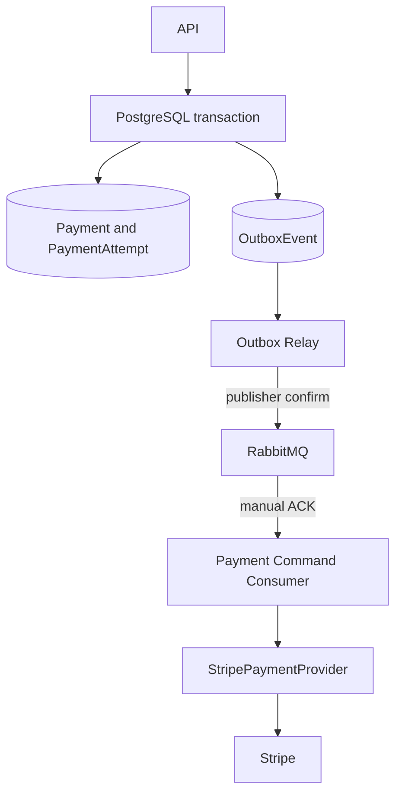

# Transactional outbox to RabbitMQ

Status: current for the `outbox-rabbitmq` learning branch.

This branch changes only the outbound provider-command delivery boundary. PostgreSQL still commits business state and the transactional outbox together. A dedicated relay moves committed provider commands to RabbitMQ, and dedicated consumers execute them through the existing `PaymentProvider` abstraction.

No real RabbitMQ or Stripe credentials are required for builds or automated tests. Broker and Stripe network boundaries are mocked.

## Architecture



The API does not publish to RabbitMQ. It returns after the PostgreSQL transaction commits.

## Runtime roles

| Runtime | Entry point | Responsibility |
| --- | --- | --- |
| HTTP API | `src/main.ts` | Accept intent and commit domain state plus outbox rows. |
| Outbox relay | `src/outbox-relay.ts` | Claim provider-command outbox rows, confirm-publish them, and mark them published. |
| Payment consumer | `src/payment-command-worker.ts` | Consume RabbitMQ commands and call `PaymentProvider`. |
| Scheduled worker | `src/worker.ts` | BullMQ scheduling for webhook inbox, settlement, reconciliation, and the existing internal payout outbox. |

All four are Nest application entry points in one codebase, but they are separate processes with separate root modules.

## API transaction remains unchanged

For capture, `PaymentsService.capture()` still uses the API idempotency transaction to:

1. Lock and validate the payment.
2. move it to `CAPTURE_PENDING`.
3. create a `CAPTURE` attempt.
4. insert `provider.capture.requested` into `outbox_events`.
5. append audit evidence.
6. commit and return `202`.

`PaymentsService` has no RabbitMQ dependency. This preserves the transactional-outbox guarantee: either the business change and command both commit, or neither commits.

## Parent Stripe branch versus this branch

### Parent branch

```text
BullMQ outbox-poll
  -> worker
  -> PostgreSQL claim
  -> OutboxDispatcherService.dispatch()
  -> Stripe
```

BullMQ carried an empty polling job. The worker then discovered and executed commands by querying PostgreSQL.

### RabbitMQ branch

```text
PostgreSQL outbox
  -> OutboxRelayService
  -> RabbitMQ payment-provider.commands
  -> PaymentCommandConsumer
  -> PaymentCommandHandlerService
  -> StripePaymentProvider
  -> Stripe
```

The consumer does not query PostgreSQL to discover work. The RabbitMQ message contains the already-committed outbox ID, event type, aggregate ID, command payload, creation time, and correlation ID.

## Responsibility table

| Component | Owns |
| --- | --- |
| PostgreSQL | Business state, transactional outbox, unpublished-event source of truth, local provider-reference mirror. |
| Outbox relay | PostgreSQL-to-broker transfer only. It contains no Stripe or payment-domain execution logic. |
| RabbitMQ | Delivery, buffering, competing-consumer distribution, manual acknowledgements, delayed retry, and dead-letter storage. |
| Payment command consumer | Validation, failure classification, command routing, and deciding ACK/retry/dead-letter disposition. |
| Payment command handler | Calling `PaymentProvider` and committing local provider references before ACK. |
| Stripe | Provider-side financial execution and provider idempotency. |

`outbox_events.status='PUBLISHED'` means RabbitMQ confirmed publication. It does not mean Stripe executed the command.

## Outbox relay

`OutboxRelayService` claims only these event types:

- `provider.authorization.requested`
- `provider.capture.requested`
- `provider.refund.requested`
- `provider.void.requested`

The claim remains a PostgreSQL `FOR UPDATE SKIP LOCKED` statement. It atomically changes one eligible row to `PROCESSING`, records `locked_at`, and increments `attempts`. Multiple relay processes therefore claim different rows without blocking each other.

After the claim commits, the relay:

1. Builds the broker envelope.
2. publishes a persistent message.
3. waits for the confirm channel's publisher confirmation.
4. marks the row `PUBLISHED` only after confirmation.

On a broker or network failure, the row returns to `PENDING` with capped exponential delay. Publication failures remain retryable rather than becoming an authoritative business failure.

The relay compares the row's `locked_at` value when completing or releasing the claim. This prevents a stale relay instance from overwriting a newer lease.

### Unavoidable duplicate-publication gap

```text
RabbitMQ accepts and confirms message
  -> relay process crashes
  -> PostgreSQL never records PUBLISHED
  -> lease expires
  -> relay publishes the same outbox ID again
```

The transactional outbox prevents lost committed commands. It does not provide exactly-once broker publication. The stable outbox ID becomes RabbitMQ `messageId`, making duplicates identifiable.

## RabbitMQ topology

The topology is deliberately small and explicit.

| Kind | Name | Purpose |
| --- | --- | --- |
| Direct exchange | `fintech.commands` | Main provider-command routing. |
| Durable queue | `payment-provider.commands` | Commands ready for consumers. |
| Direct exchange | `fintech.commands.retry` | Confirm-published retry copies. |
| Durable queue | `payment-provider.commands.retry` | Five-second retry delay before dead-lettering back to the main exchange. |
| Direct exchange | `fintech.commands.dead` | Permanently failed or exhausted messages. |
| Durable queue | `payment-provider.commands.dead` | Operator-visible dead-letter storage. |

All three queues bind the four provider routing keys. Exchanges and queues are durable, and published messages use persistent delivery mode.

Message properties include:

- `messageId`: PostgreSQL outbox event ID.
- `correlationId`: attempt ID, refund ID, payment ID, or aggregate ID.
- `type`: provider event type.
- `timestamp`: outbox creation time.
- headers for event type, creation time, retry count, and failure reason.

## Consumer ACK, retry, and dead-letter model

The consumer uses manual acknowledgements and configurable prefetch, defaulting to 10.

### Success

```text
consume
  -> validate envelope
  -> call PaymentProvider
  -> transactionally upsert provider mirror and local references
  -> commit
  -> ACK original message
```

The ACK is intentionally after the durable local transaction. A synchronous Stripe result that was not recorded locally is not treated as completed consumer work.

### Retryable or unknown outcome

For `RetryableProviderError`, `UnknownProviderOutcomeError`, and unclassified infrastructure errors:

1. publish a copy to `fintech.commands.retry` with incremented `x-retry-count`.
2. wait for publisher confirmation.
3. ACK the original message.
4. the retry queue holds the message for five seconds and dead-letters it back to `fintech.commands`.

This avoids an infinite immediate `nack(requeue=true)` loop. The eighth delivery attempt goes to the dead-letter queue.

### Permanent or malformed command

`PermanentProviderError`, domain validation errors, invalid JSON, mismatched message IDs/routing keys, and malformed payloads are confirm-published to `fintech.commands.dead`, then the original is ACKed.

### Retry/DLQ publication failure

If the retry or DLQ copy cannot be confirmed, the original is not ACKed. The adapter issues a delayed `NACK` with requeue as a loss-prevention fallback. Connection closure also causes RabbitMQ to redeliver any unacknowledged delivery.

## Provider idempotency remains mandatory

RabbitMQ acknowledgement does not make external execution exactly once.

```text
consumer calls Stripe successfully
  -> process crashes before durable local commit or ACK
  -> RabbitMQ redelivers
  -> consumer calls Stripe again
```

The broker message carries the original outbox payload unchanged, including stable keys such as `capture:<attemptId>`. Duplicate consumer execution therefore reuses the same Stripe idempotency key.

The local `provider_transactions` upsert is independently idempotent through `(provider, provider_idempotency_key)`.

## Multiple relays and consumers

With Relay #1 and Relay #2, PostgreSQL row locks plus `SKIP LOCKED` assign different pending outbox rows. The persisted processing lease recovers work after a relay crash.

With Consumer #1, #2, and #3, RabbitMQ distributes messages as competing consumers. Prefetch limits the number of unacknowledged messages assigned to each consumer.

RabbitMQ ACKs protect against silently discarding unfinished deliveries. They do not protect against a process dying after Stripe executes but before ACK. The external idempotency key remains the final defense at that boundary.

## Failure traces

### A. Business transaction commits before the relay runs

The `PENDING` outbox row survives in PostgreSQL. A later relay poll claims and publishes it.

### B. RabbitMQ is unavailable

Publisher confirmation fails. The relay releases the row to `PENDING`, sets a future `available_at`, and retries later. No Stripe call occurs.

### C. Relay publishes but crashes before marking PUBLISHED

RabbitMQ may contain the command while PostgreSQL still says `PROCESSING`. After lease expiry another relay republishes the same `messageId`. Duplicate delivery is expected.

### D. Consumer crashes before Stripe

The message remains unacknowledged. RabbitMQ redelivers it to an available consumer.

### E. Stripe succeeds but consumer crashes before ACK

RabbitMQ redelivers. The consumer reuses the same provider idempotency key, and local reference persistence uses an idempotent upsert.

### F. Malformed or permanently invalid command

The consumer confirm-publishes it to `payment-provider.commands.dead` and ACKs the original, preventing an infinite loop.

## What remains on BullMQ

BullMQ no longer has `outbox-poll` for provider commands. It remains the repeat scheduler for:

- PostgreSQL webhook inbox polling.
- settlement generation/completion.
- reconciliation.
- the existing internal `payout.process` outbox path, now explicitly named `internal-outbox-poll`.

The payment-provider path is exclusively PostgreSQL outbox -> relay -> RabbitMQ -> consumer. BullMQ and RabbitMQ do not carry the same provider command.

## What each pattern solves

Transactional outbox solves the atomicity gap between committing database state and requesting later message publication.

RabbitMQ adds message distribution, competing consumers, buffering, backpressure through prefetch, acknowledgement lifecycle, delayed retry, and dead-letter storage.

RabbitMQ does not provide exactly-once external financial execution, business idempotency, provider idempotency, or a distributed transaction with Stripe.

Provider idempotency protects relay duplicates, RabbitMQ redelivery, consumer crashes, and unknown network outcomes.

## Local execution and tests

Unit tests use mocked `CommandBroker`, amqplib channels, and Stripe clients. They do not connect to RabbitMQ or Stripe.

Running `pnpm dev:relay` or `pnpm dev:payment-consumer` against a real broker requires a human-provided `RABBITMQ_URL`. The checked-in value is a local placeholder. This branch does not provision or deploy RabbitMQ.

## Diff-based reading order

### Files intentionally almost unchanged

1. `payments/payments.service.ts` - still commits payment state, attempt, audit, and outbox together; it did not acquire a broker dependency.
2. `outbox/outbox.service.ts` - still inserts the durable command using the caller's PostgreSQL transaction.
3. `payment-provider/payment-provider.types.ts` - the provider port remains independent of RabbitMQ.
4. `payment-provider/stripe-payment.provider.ts` - Stripe SDK mapping and stable idempotency behavior remain the same.
5. `webhooks/webhook-receiver.service.ts` and `webhook-processor.service.ts` - signed webhook ingress and the PostgreSQL inbox path remain unchanged.

### Removed from the provider-command path

6. `outbox/outbox-dispatcher.service.ts` - previously both claimed PostgreSQL rows and called Stripe; it is removed because relay and consumer are now separate responsibilities.
7. `jobs/coordination.processor.ts` and `job-scheduler.service.ts` - provider `outbox-poll` is gone; BullMQ retains scheduled non-provider work.

### New infrastructure and responsibilities

8. `rabbitmq/rabbitmq.types.ts` - defines the broker-neutral contract, message envelope, topology names, and ACK/retry/dead dispositions.
9. `rabbitmq/rabbitmq.service.ts` - owns amqplib connections, topology declaration, publisher confirms, manual ACKs, retry publication, DLQ publication, and reconnect behavior.
10. `outbox/outbox-relay.service.ts` - owns only PostgreSQL-to-RabbitMQ transfer and publication leases.
11. `payment-commands/payment-command.consumer.ts` - validates deliveries and classifies ACK, retry, or dead-letter outcomes.
12. `payment-commands/payment-command-handler.service.ts` - routes already-delivered commands to `PaymentProvider` and commits the local provider mirror before ACK.
13. `outbox-relay.ts` and `payment-command-worker.ts` - make relay and consumer independently runnable Nest application contexts.
