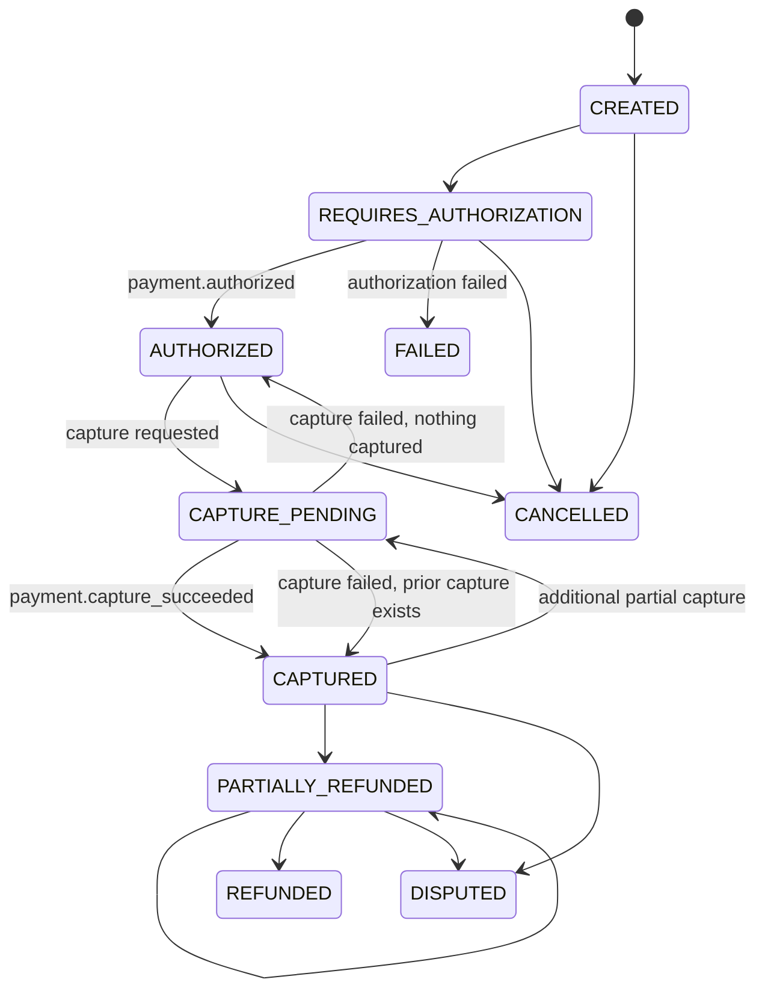

# Payment lifecycle

Status: current.



`POST /payments` creates intent in minor units. Manual capture waits for explicit authorization/capture commands. Automatic capture records an authorization request and, after the authorized webhook, creates a capture outbox event. Partial captures use the same capture operation while the remaining authorized amount is positive.

```mermaid
sequenceDiagram
  participant Merchant
  participant API
  participant DB
  participant PSP
  participant Inbox
  Merchant->>API: POST /payments/:id/capture + Idempotency-Key
  API->>DB: lock payment; record attempt + outbox
  API-->>Merchant: 202 capture_pending
  DB-->>PSP: outbox worker capture(idempotency key)
  PSP-->>Inbox: signed payment.capture_succeeded
  Inbox->>DB: update aggregate + post balanced journal
```

Authorization reserves customer funding capacity only. Capture creates a provider receivable and merchant pending liability. Settlement converts the provider receivable to cash and moves merchant pending to available. Payout consumes available funds. These are deliberately separate.
