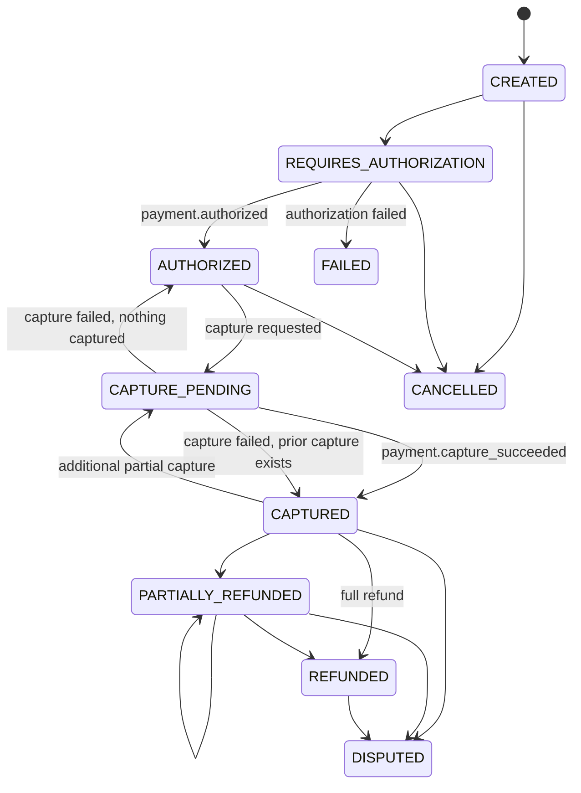
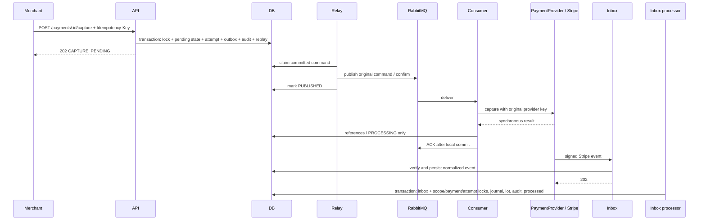

# Payment lifecycle

Status: current.

`POST /payments` creates intent in minor units. Manual capture waits for explicit authorization/capture commands. Automatic capture records an authorization request and, after the authorized webhook, creates a capture outbox event. Partial captures use the same capture operation while the remaining authorized amount is positive.

Authorization reserves customer funding capacity only. Capture creates a provider receivable and merchant pending liability. Settlement converts the provider receivable to cash and moves merchant pending to available. Payout consumes available funds. These are deliberately separate.

The sequence illustrates successful capture; webhook receipt can precede consumer reference persistence or ACK. Completion is driven by inbox processing, not by the synchronous response. Settlement/payout are internal accounting simulations. Partial capture is modeled by the application, but Stripe multicapture availability is account/payment-method dependent and not externally verified. Cancellation records local `CANCELLED` at request acceptance; see the [provider boundary limits](real-psp-stripe.md#translation-and-terminology-mismatches).

Confirmed new capture success also creates one `capture_accounting_lots` row in this same transaction, linked to the actual POSTED CAPTURE journal. Original gross/fee/net and exact financial posting time come from PostgreSQL journal evidence; eligibility freezes the merchant delay read for that posting as elapsed 24-hour days. A lot failure rolls back the journal, attempt/payment updates, mirror and audit. Duplicate successful attempts return without posting or backfilling old captures. These lots are dormant original evidence: refund/dispute/settlement services still use legacy accounting. See [B2.1 evidence and cutover limits](audits/h1-fix-02-b2-1-capture-integration.md).
