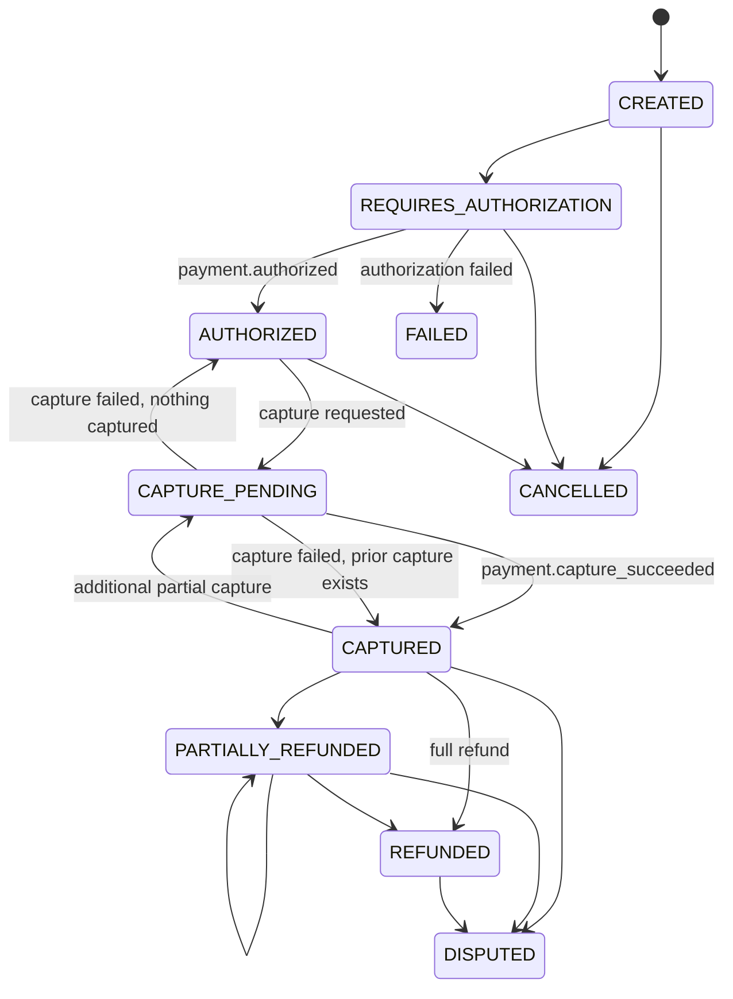
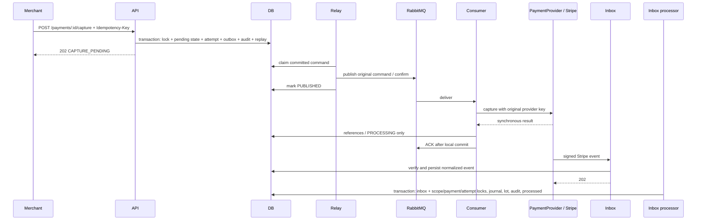

# Payment lifecycle

Status: current.

```mermaid
stateDiagram-v2
  [*] --> CREATED
  CREATED --> REQUIRES_AUTHORIZATION
  REQUIRES_AUTHORIZATION --> AUTHORIZED: payment.authorized
  REQUIRES_AUTHORIZATION --> FAILED: authorization failed
  AUTHORIZED --> CAPTURE_PENDING: capture requested
  CAPTURE_PENDING --> CAPTURED: payment.capture_succeeded
  CAPTURE_PENDING --> AUTHORIZED: capture failed, nothing captured
  CAPTURE_PENDING --> CAPTURED: capture failed, prior capture exists
  CAPTURED --> CAPTURE_PENDING: additional partial capture
  CREATED --> CANCELLED
  REQUIRES_AUTHORIZATION --> CANCELLED
  AUTHORIZED --> CANCELLED
  CAPTURED --> PARTIALLY_REFUNDED
  CAPTURED --> REFUNDED: full refund
  PARTIALLY_REFUNDED --> PARTIALLY_REFUNDED
  PARTIALLY_REFUNDED --> REFUNDED
  CAPTURED --> DISPUTED
  PARTIALLY_REFUNDED --> DISPUTED
  REFUNDED --> DISPUTED
```

`POST /payments` creates intent in minor units. Manual capture waits for explicit authorization/capture commands. Automatic capture records an authorization request and, after the authorized webhook, creates a capture outbox event. Partial captures use the same capture operation while the remaining authorized amount is positive.

```mermaid
sequenceDiagram
  participant Merchant
  participant API
  participant DB
  participant Relay
  participant Broker as RabbitMQ
  participant Consumer
  participant PSP as PaymentProvider / Stripe
  participant Inbox
  participant Worker as Inbox processor
  Merchant->>API: POST /payments/:id/capture + Idempotency-Key
  API->>DB: transaction: lock + pending state + attempt + outbox + audit + replay
  API-->>Merchant: 202 CAPTURE_PENDING
  Relay->>DB: claim committed command
  Relay->>Broker: publish original command / confirm
  Relay->>DB: mark PUBLISHED
  Broker->>Consumer: deliver
  Consumer->>PSP: capture with original provider key
  PSP-->>Consumer: synchronous result
  Consumer->>DB: references / PROCESSING only
  Consumer->>Broker: ACK after local commit
  PSP->>Inbox: signed Stripe event
  Inbox->>DB: verify and persist normalized event
  Inbox-->>PSP: 202
  Worker->>DB: transaction: inbox + scope/payment/attempt locks, journal, lot, audit, processed
```

Authorization reserves customer funding capacity only. Capture creates a provider receivable and merchant pending liability. Settlement converts the provider receivable to cash and moves merchant pending to available. Payout consumes available funds. These are deliberately separate.

## Dormant MANUAL authorization application

[Migration0013](../apps/api/drizzle/0013_manual_authorization_application.sql) defines the private P-B SQL contract. A restricted caller prepares from an accepted AUTHORIZE command, its exact signed B1 proof, current inbox claim and expected evidence revisions, then applies the frozen SQL plan in the same READ COMMITTED transaction. It requires the original complete D02 COMMAND_RESULT and a MANUAL payment awaiting authorization. Success establishes the canonical root, tagged proof, successful attempt, AUTHORIZED payment, immutable provider audit, exact source dispositions, scope revision and PROCESSED inbox atomically.

The result is `VERIFIED_NO_EFFECT` with reason `AUTHORIZE_SUCCESS`: authorization recognizes no captured principal, fee, ledger journal or accounting lot. The original source obligations remain stored; only complete owned application evidence suppresses their exact causes for admission. A distinct source, reblocked receipt revision, delivery barrier or OPEN exception remains effective. Original-result recognition verifies historical evidence without repeating effects or requiring today's whole payment image to equal its authorization image.

Installation leaves contracts and enrollment empty and grants no runtime LOGIN capability. Private test composition installs only its DORMANT LEGACY/epoch0 contract. Production handlers remain unchanged. Automatic authorization, capture acknowledgment/recovery and activation require separate checkpoints. The permanent [application](../apps/api/test/integration/manual-authorization-application.spec.ts) and [migration](../apps/api/test/integration/manual-authorization-migration.spec.ts) suites define the acceptance checks; execution results belong to the task checkpoint, not this contract description.

## Dormant protected first capture intent

[Migration0014](../apps/api/drizzle/0014_first_capture_intent.sql) adds the private P-C intent boundary. A caller supplies the completed P-B authorization root, a private request key, gross amount, fixture variant and expected payment/scope/intake revisions. SQL derives the owner, original authorization capacity, provider account/PaymentIntent, command identity and response. New work requires the exact P-B AUTHORIZED after-image, MANUAL capture, no prior capture/void or financial effects and no effective evidence blocker.

Each fresh authorization supports one first intent: FULL requests all authorized principal with `finalCapture=true`; FIRST_PARTIAL requests less with `finalCapture=false`; FINAL_PARTIAL requests less with `finalCapture=true`. This last variant is a private evidence fixture, not a new HTTP API option or verified Stripe multicapture entitlement. A second distinct request on the same payment is refused. All recognized monetary totals and the original AUTH record remain unchanged.

One READ COMMITTED transaction establishes CAPTURE_PENDING/version+1, the PENDING CAPTURE attempt, exact outbox, accepted D02 command, immutable audit, private replay response and guarded scope revision. The shared transaction/backend permit admits exclusively APPLICATION or CAPTURE_INTENT. Immediate exact-write guards and deferred complete-group validation reject missing or extra writes and prepare-only commits. Request replay verifies the immutable accepted intent and returns the original response without another command, permit or revision; later delivery bookkeeping does not redefine that response.

The [intent](../apps/api/test/integration/first-capture-intent.spec.ts) and [migration](../apps/api/test/integration/first-capture-intent-migration.spec.ts) suites exercise this contract using genuine P-B chains and restricted fixture principals. Scripted D02 execution and separately signed B1 sealing/binding occur only after intent commit. At that boundary the signed capture receipt remains AWAITING_APPLICATION; its original D02 source retains BLOCKING_REVIEW/CAPTURE_AMOUNT_ATTRIBUTION_REQUIRED, and no capture journal/lot exists. B2-A owns monetary preparation, B2-B the atomic first application described below, and B2-C capture acknowledgment/recovery. Installation grants no runtime LOGIN, installs no contract/enrollment and changes no production routing.

## Dormant capture financial preparation

[B2-A SQL0015](../apps/api/drizzle/0015_capture_application_preparation.sql) accepts only a completed P-C MANUAL/TEST/LEGACY epoch0 first intent and its exact bound B1 success proof. `claim_capture_preparation` commits a bounded nonterminal inbox lease through P-B's existing protected claim witness. A separate caller-owned READ COMMITTED transaction calls `prepare_capture_application` with the intent/inbox/proof selectors, current generation and expected obligation/scope/intake revisions. The frozen B1 seal generation and original revision are historical provenance, distinct from this later claim and binding revision.

`read_capture_preparation` exposes the transaction's SQL-derived principal, cumulative fee/net, intended journal legs, original lot/eligibility and finality/source coverage. The existing formula remains cumulative: fee after capture is `min(captured, floor(captured * fee_bps / 10000) + fixed_fee_minor)`; the capture receives its delta from the prior fee. Intermediate products and sums must fit the existing safe-integer boundary. Zero fee/net omits only that journal leg. Merchant terms come from one SQL snapshot at preparation time.

At the SQL0015 prefix this checkpoint permits inspection followed by **ROLLBACK only**. Its COMMIT, autocommit and immediate constraint checking refuse capture preparation, and no financial effect or source clearance can consume its permit. The B2-A regression suites retain that prefix contract; SQL0016 supplies the complete first-application contract below. Neither installation activates production routing.

## Dormant atomic first capture application

[B2-B SQL0016](../apps/api/drizzle/0016_capture_financial_application.sql) upgrades the same preparation selector API to an executable `CAPTURE_APPLICATION_V1` manifest. Only the genuine completed P-B authorization → committed P-C first intent → separately published D02 and bound signed B1 success chain qualifies. MANUAL/STRIPE/TEST, recorded LEGACY/epoch0/DORMANT authority and the independently proved FULL, FIRST_PARTIAL or FINAL_PARTIAL variant remain required. The SQL writer accepts no caller-supplied amount, account, timestamp or after-image.

In one caller-owned READ COMMITTED transaction, `prepare_capture_application` freezes the current claim, source inventory, revisions, exact financial rows and merchant fee/delay terms. Positive-leg accounts resolve by owner/code/currency in PSP_CLEARING → MERCHANT_PENDING → PLATFORM_FEE_REVENUE order; existing account types must match and display names remain unchanged. Account SHARE locks preserve those identities through commit. `apply_capture_application()` writes and seals one CAPTURE journal, succeeds the original attempt, updates cumulative captured principal/fee and payment version once, and inserts one NEW_CAPTURE lot. The lot copies original gross/fee/net and exact PostgreSQL posting time; eligibility adds the frozen delay in elapsed 24-hour days.

Completion also requires the financial audit, exactly two typed journal/lot links, canonical application, own exact receipt disposition, each independently covered D02 source disposition, own generation-checked PROCESSED inbox and one guarded scope revision increment. Intake revision is unchanged by financial application. Original obligations and raw sources remain immutable; admission suppresses only exact causes whose complete immutable application linkage validates. Immediate guards and independently reachable deferred checks reject incomplete or extra groups, including prepare-only commit and rootless protected effects. Any failure rolls back newly created accounts and every financial/finality effect; previously committed evidence and claim remain retained. An SQL return value is provisional until COMMIT succeeds.

Equivalent peer receipts receive no disposition or inbox finality and continue to block spending. A committed application makes same-inbox reapplication and distinct-inbox application refuse; abort-first competition may apply after full rollback. Duplicate acknowledgment, late-source acknowledgment, lost-COMMIT recovery, subsequent shared-PaymentIntent captures and capture-failure finality remain closed pending B2-C. Installation grants no runtime LOGIN, installs no contract/enrollment and activates no scope or production handler. The [application](../apps/api/test/integration/capture-financial-application.spec.ts), [concurrency](../apps/api/test/integration/capture-financial-application-concurrency.spec.ts) and [migration](../apps/api/test/integration/capture-financial-application-migration.spec.ts) suites define acceptance checks; this contract description makes no execution or F01/F04/F05/F06 closure claim.

The runtime sequence described earlier permits webhook receipt before consumer reference persistence or ACK. Completion is driven by inbox processing, not by the synchronous response. Settlement/payout are internal accounting simulations. Partial capture is modeled by the application, but Stripe multicapture availability is account/payment-method dependent and not externally verified. Cancellation records local `CANCELLED` at request acceptance; see the [provider boundary limits](real-psp-stripe.md#translation-and-terminology-mismatches).

Confirmed new capture success also creates one `capture_accounting_lots` row in this same transaction, linked to the actual POSTED CAPTURE journal. Original gross/fee/net and exact financial posting time come from PostgreSQL journal evidence; eligibility freezes the merchant delay read for that posting as elapsed 24-hour days. A lot failure rolls back the journal, attempt/payment updates, mirror and audit. Duplicate successful attempts return without posting or backfilling old captures. These lots are dormant original evidence: refund/dispute/settlement services still use legacy accounting. See [B2.1 evidence and cutover limits](audits/h1-fix-02-b2-1-capture-integration.md).
