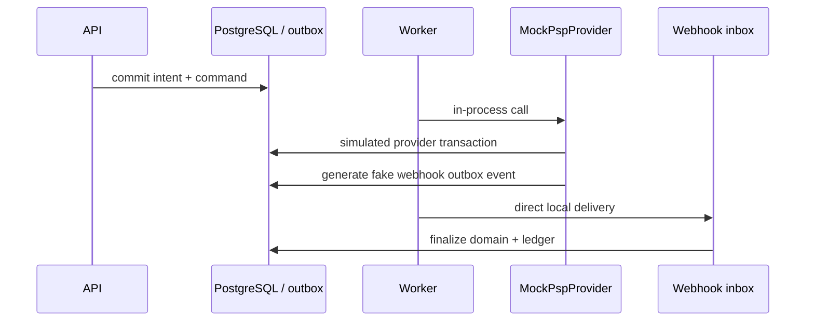
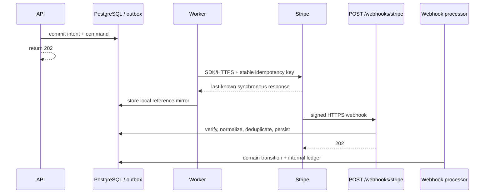
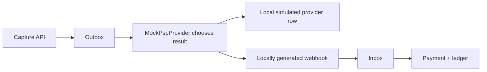
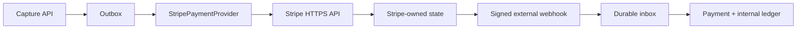

# Stripe provider boundary

Status: current for provider mapping and ownership. The polling-worker comparison describes parent commit `286c8c3` (`real-psp-stripe`); current outbound delivery uses [RabbitMQ relay/consumers](outbox-rabbitmq.md). Not deployed; no live calls are used by automated tests.

This branch keeps the modular monolith, transactional outbox, durable webhook inbox, internal ledger, settlements, payouts, refunds, and reconciliation. It changes one boundary: provider execution belongs to an external Stripe account rather than an in-process simulator.

## Historical Mock architecture

On the original branch, `MockPspProvider` is both adapter and provider simulator. It chooses outcomes from `ProviderScenario`, creates fake provider IDs, writes an authoritative-looking `provider_transactions` row, creates a fake provider webhook in our outbox, and lets the worker call `WebhookReceiverService` directly. `report()` reads that same local provider database for reconciliation.

That is useful for deterministic failure exercises, but it is not a real trust or network boundary: our application owns both sides of the interaction and generates the evidence that later confirms its own command.



## Real Stripe architecture

`StripePaymentProvider` implements the unchanged dependency direction: application services depend on `PaymentProvider`; only the infrastructure adapter imports the Stripe SDK. The worker makes an HTTPS SDK call after claiming an outbox row. Stripe owns execution and later sends a separately signed HTTPS webhook to `POST /api/v1/webhooks/stripe`.

The endpoint uses Stripe's `constructEvent` with the exact raw body and `STRIPE_WEBHOOK_SECRET`. It normalizes supported Stripe events, persists them by external event ID, and returns `202`. A worker later claims the inbox row and performs financial business logic in a database transaction.



No Stripe call occurs inside the transaction that claims or creates the outbox record. No provider adapter calls the webhook receiver. No application code generates a Stripe webhook.

## Ownership table

| Our system owns | Stripe owns |
| --- | --- |
| Payment state | Actual provider payment execution |
| PaymentAttempt state | PaymentIntent, Charge, Refund, and Dispute objects |
| Transactional outbox | Card/bank interaction and authentication |
| Durable webhook inbox and processing leases | Provider-side idempotency behavior |
| Double-entry ledger and merchant balance | Provider event generation and webhook delivery |
| Audit history | Provider-side final execution state |
| Reconciliation issues and resolutions | Provider balance, settlement, and payout reporting |
| Internal settlement and payout workflow | External movement on Stripe's rails |

`provider_transactions` remains for observability and correlation, but its rows are local references/cache entries. `provider_transaction_id`, `payment_intent_id`, `charge_id`, last-known `status`, selected response metadata, and `last_synced_at` are not authoritative provider truth. Multiple internal commands may reference the same PaymentIntent, so the external object ID is no longer unique; the stable provider idempotency key remains unique per provider command.

## Compare the capture flow

### Mock version



### Real Stripe version



The API transaction still locks the payment, validates the remaining authorization, sets `CAPTURE_PENDING`, creates a `CAPTURE` attempt, writes `provider.capture.requested`, audits, commits, and returns `202`. The worker derives `capture:<attemptId>` once and passes it unchanged on every SDK retry. A synchronous `succeeded` response only records a provider mirror and moves the attempt to `PROCESSING`; it does not post the ledger or mark the payment captured.

## Translation and terminology mismatches

| Internal concept | Stripe mapping | Important mismatch |
| --- | --- | --- |
| Authorization | Confirmed PaymentIntent with `capture_method=manual` | Some payment methods require customer action; this branch does not build that frontend flow. |
| Capture | `paymentIntents.capture` | Partial multi-capture requires Stripe multicapture availability; `final_capture=false` can be rejected when the account/payment method lacks it. |
| Void/cancel | `paymentIntents.cancel` | Stripe can cancel only PaymentIntents in cancellable states. |
| Refund | `refunds.create` against the PaymentIntent | Refund completion can be asynchronous for some payment methods. |
| Provider transaction | PaymentIntent plus optional Charge/Refund IDs | There is no single Stripe object matching every internal operation. |
| Settlement | Internal accounting availability workflow | Stripe balance transactions/payout reports are a separate external reporting boundary, not implemented here. |

The request's `paymentMethodToken` is treated as an already-created Stripe PaymentMethod ID. This branch does not collect card data, create Checkout, or provide a browser confirmation flow.

The existing domain has no `CANCEL_PENDING` state, so its cancel API still records `CANCELLED` when the local command is accepted and lets the webhook confirm the void attempt. That legacy mismatch is documented instead of expanding the payment state machine in a provider-boundary learning branch; a production design should introduce an explicit pending/failed cancellation lifecycle.

## Webhook event mappings

| Stripe event/object | Normalized internal event | Notes |
| --- | --- | --- |
| `payment_intent.amount_capturable_updated` / PaymentIntent | `payment.authorized` | When authorization metadata is present. After a multicapture, capture metadata distinguishes `payment.capture_succeeded`. |
| `payment_intent.payment_failed` / PaymentIntent | `payment.authorization_failed` or `payment.capture_failed` | The adapter's attempt metadata selects the internal phase. |
| `payment_intent.succeeded` / PaymentIntent | `payment.capture_succeeded` | Capture amount comes from immutable internal-attempt metadata written on the provider command. |
| `payment_intent.canceled` / PaymentIntent | `payment.cancelled` | The processor can correlate the void attempt through the local mirror. |
| `refund.created`, `refund.updated`, `refund.failed` / Refund | `refund.succeeded` or `refund.failed` | Pending refund states are retained as unsupported until a terminal update arrives. |
| `charge.dispute.created`, `charge.dispute.closed` / Dispute | `dispute.opened`, `dispute.closed` | Missing merchant/payment metadata is resolved asynchronously through PaymentIntent/Charge references. |

Every other Stripe event is persisted as `provider.unsupported` and marked `IGNORED`; it is not silently treated as handled.

## Source of truth

These three views are deliberately distinct:

```text
Internal Payment state != Stripe state != Ledger/accounting state
```

- Internal Payment and PaymentAttempt rows are our workflow view.
- Stripe objects are the authoritative provider execution view.
- The ledger is our immutable accounting view and is changed only by our domain transaction.

A synchronous SDK response, webhook, or reconciliation observation may reveal Stripe state. None of them lets Stripe write our ledger. Capture completion still locks the inbox row, attempt, and payment; validates identity, merchant, amount, currency, and known provider references; posts a balanced journal; updates the aggregate; audits; and marks the inbox row processed in one transaction.

## Unknown outcome

Consider this sequence:

1. The worker sends `capture:<attemptId>` to Stripe.
2. Stripe applies the capture.
3. The HTTP response is lost before our worker sees it.

A network timeout is therefore not a provider failure. `StripePaymentProvider` raises `UnknownProviderOutcomeError`, and the dispatcher requeues the same command rather than creating a different request. Recovery has four independent supports:

- the same provider command always has the same Stripe idempotency key, including bounded outbox retries;
- Stripe may still deliver the signed success webhook with our correlation metadata;
- once a PaymentIntent reference is known, `fetchStatus()` can query provider-owned state;
- reconciliation records disagreement for review without changing ledger history.

The local mirror can be absent in the narrow response-loss window. A retry with the same key can recover the original response/reference, while webhook metadata can independently complete inbox processing. If retries exhaust and the webhook is also unavailable, an operator must recover the external object reference through Stripe-side tooling before a status query can help; this branch does not pretend a local row can answer that question.

## Refund flow

Refund creation still locks the payment, enforces remaining refundable amount, creates the refund intent and `provider.refund.requested` outbox record, audits, and returns `202`. The worker calls `refunds.create` with `refund:<refundId>`. A synchronous response stores the Refund/PaymentIntent/Charge references only. A later `refund.created`, `refund.updated`, or `refund.failed` event drives internal refund state and the compensating ledger journal.

## Reconciliation

The old `report()` port was removed because it read our own simulator database. Reconciliation now groups internal capture attempts by referenced PaymentIntent and calls `PaymentProvider.fetchStatus()` for provider-owned state. It detects:

- Stripe succeeded while our payment remains `CAPTURE_PENDING` (often a missing webhook-processing outcome);
- an internally succeeded attempt whose Stripe object is not found;
- payment amount or currency mismatch;
- captured-total mismatch;
- an internal success while Stripe is in a contradictory state.

It cannot discover arbitrary Stripe objects that have no internal reference because this learning branch deliberately avoids implementing Stripe report pagination/export ingestion. A production system would add a separate provider-report feed for completeness. Reconciliation remains detection-only and never rewrites payments or ledger entries.

## Settlement boundary

The existing settlement table and journals remain internal business/accounting concepts: they move merchant liability from pending to available after the configured delay. They do not claim to control Stripe settlement, Stripe Balance Transactions, bank payouts, reserves, fees, or availability dates.

Real provider settlement evidence would normally arrive from Stripe Balance/Balance Transaction/Payout APIs or reports behind a separate interface. This branch leaves that interface as a documented boundary rather than inventing a false integration. Internal payouts also remain a lab workflow; they do not create Stripe payouts or move real money.

## Configuration and test safety

Only placeholder configuration is checked in:

```dotenv
STRIPE_SECRET_KEY=sk_test_placeholder
STRIPE_WEBHOOK_SECRET=whsec_placeholder
```

Creating the SDK client does not make a request. Unit tests inject a mocked Stripe client for provider operations. Webhook tests use the SDK's local signing helpers and cryptographic verification only. Database integration tests persist signed test events and run the normal inbox processor without any external network call.

Running the API/worker with placeholders is suitable for reading, builds, and tests, but provider commands cannot execute successfully. A manually operated test-mode exercise would require human-supplied test credentials, a test PaymentMethod, and webhook forwarding; that is intentionally not part of this branch or its automated verification.

## Learning map: read only the Mock-to-Stripe differences

1. `apps/api/src/payment-provider/payment-provider.types.ts`
   - Changed: scenario/report concepts were removed; results now carry provider object references and `fetchStatus` queries external state.
   - Why: the domain needs a narrow provider contract without owning provider behavior.
   - Moved outside: outcome selection, provider object lifecycle, and provider report truth.

2. `apps/api/src/payment-provider/stripe-payment.provider.ts`
   - Changed: SDK calls translate authorize/capture/cancel/refund to PaymentIntent and Refund operations and classify timeout as unknown.
   - Why: this is the anti-corruption layer between internal terminology and Stripe's model.
   - Moved outside: execution, ID generation, state transitions, and provider idempotency storage.

3. `apps/api/src/payments/payments.service.ts`, `apps/api/src/refunds/refunds.service.ts`, and the historical outbox dispatcher (removed on the RabbitMQ branch; now `apps/api/src/payment-commands/payment-command-handler.service.ts`)
   - Changed: scenario flags disappeared; commands carry the known PaymentIntent reference; the worker writes a mirror after SDK responses.
   - Why: reliable internal intent/outbox behavior remains, while remote work happens after commit.
   - Moved outside: simulated synchronous outcomes and local webhook generation.

4. `apps/api/src/webhooks/webhooks.controller.ts` and `webhook-receiver.service.ts`
   - Changed: `/webhooks/stripe` verifies `stripe-signature` against the raw body with the official SDK and deduplicates `evt_*` IDs.
   - Why: ingress is now a real untrusted HTTPS boundary.
   - Moved outside: event creation and delivery scheduling.

5. `apps/api/src/webhooks/stripe-event.normalizer.ts`
   - Changed: supported Stripe objects become provider-neutral internal events; everything else is explicit `provider.unsupported`.
   - Why: Stripe event names and object shapes should not leak through the domain.
   - Moved outside: Stripe's taxonomy remains at the adapter edge.

6. `apps/api/src/webhooks/webhook-processor.service.ts` and `webhook-business.service.ts`
   - Changed: processing correlates external references, validates identity/provider references, updates the mirror, and retains existing inbox leases/retries.
   - Why: webhook delivery is at least once and may race the SDK response.
   - Moved outside: delivery order and exactly-once assumptions.

7. `WebhookBusinessService.captureSucceeded()`
   - Changed: very little domain logic; it still locks, validates, posts the capture journal, updates attempt/payment, audits, and completes the inbox atomically.
   - Why: the ledger and merchant balance remain internal regardless of provider.
   - Moved outside: only the evidence that provider capture occurred.

8. `apps/api/src/reconciliation/reconciliation.service.ts`
   - Changed: local `report()` comparison became Stripe status lookup per referenced PaymentIntent.
   - Why: reconciliation must compare independent sources, not two tables owned by the same simulator.
   - Moved outside: authoritative provider state and completeness of provider reporting.

9. `apps/api/src/database/schema.ts` and `drizzle/0001_lively_fabian_cortez.sql`
   - Changed: mock profiles/scenario columns were removed; provider mirror rows gained attempt, PaymentIntent, Charge, and sync references; external IDs may repeat across commands.
   - Why: the table records correlation/cache data, not a simulated provider ledger.
   - Moved outside: authoritative transaction records and provider-side uniqueness rules.
