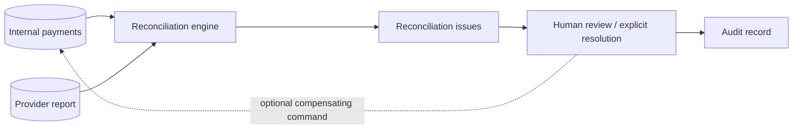

# Reconciliation

Status: current.

Reconciliation compares the internal view with the Mock PSP report. It creates issues for:

- capture pending internally but captured at the provider;
- captured internally but missing/not captured at the provider;
- amount or currency mismatch;
- a provider transaction unknown internally;
- duplicate provider capture transactions;
- settled status mismatch.

The job never changes payment status or ledger history silently. A human resolution endpoint records a note, actor, and audit event. In production, selected issue types could propose a remediation command, but that command would still be explicit, idempotent, and audited.
