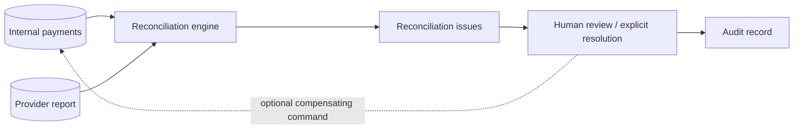

# Reconciliation

Status: current.

Reconciliation compares the internal view with Stripe state queried through `PaymentProvider.fetchStatus()`. It creates issues for:

- capture pending internally but captured at the provider;
- captured internally but missing/not captured at the provider;
- amount or currency mismatch;
- a referenced provider object that Stripe does not find;
- contradictory captured totals or provider status.

The job never changes payment status or ledger history silently. It queries only provider objects already referenced internally; discovering arbitrary unreferenced Stripe objects would require a separate report/export ingestion boundary. A human resolution endpoint records a note, actor, and audit event.
