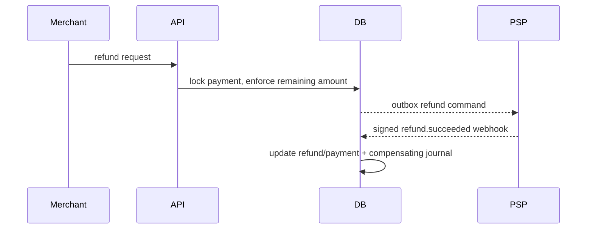

# Refunds and disputes

Status: current.

Refund creation locks the payment row and sums accepted/succeeded refunds. It rejects an amount that would exceed captured funds. The local request and provider outbox event commit together. Provider failure releases the pending amount; provider success increments `refunded_amount` and posts a compensating ledger journal. Multiple partial refunds are supported and idempotent.

A dispute open event records the case and moves merchant funds into dispute clearing. If the merchant wins, those entries are reversed. If the merchant loses, dispute clearing is released against platform cash. The original capture journal remains unchanged. This lab models a single dispute amount and final win/loss; it omits evidence file exchange, representment stages, network fees, and scheme deadlines.

## Dormant capture-owned refund path

[B2.2](audits/h1-fix-02-b2-2-refund-integration.md) implements a separate `CaptureRefundAccountingService`, absent from live modules/controllers/webhook dispatch. Its default gate requires ACTIVE, which the current schema forbids. An isolated PostgreSQL test subclass admits synthetic dormant fixtures. Current refund/dispute behavior above is unchanged; this is not F01 closure or production activation.

The staged service reserves gross FIFO by immutable financial capture time/attempt ID, freezes refund/lot rows, and emits one existing refund command only when selected lots share one known PaymentIntent. Later captures cannot retarget the request. Confirmed success uses each original capture fee's exact cumulative BigInt reversal, own pending entitlement and finalized settlement state: unsettled assets credit PSP_CLEARING; finalized assets credit PLATFORM_CASH. Available bears explained debt when pending entitlement is absent. Pending Option A reserves capacity without liability holds or payout protection. Confirmed failure releases only its reservation; unknown outcomes retain capacity.

Journal, allocations, refund/payment state, audit and the locked inbox disposition commit together. Ambiguous/contradictory evidence remains in the immutable inbox, linked to an OPEN accounting exception and ACCOUNTING_EXCEPTION disposition; it posts no guessed journal or automatic release. Released allocations cannot be revived by late success. Disjoint refunds needing hold-funding adjustments defer to B2.3 review. Current pooled payout/settlement writers do not enforce these exceptions. Runtime admission, dispatch disposition handling, legacy reconciliation and coordinated dispute/settlement writers must precede activation.

B2.2.1 validates event and trusted refund mirror PaymentIntent independently against frozen capture attribution before terminal replay or financial changes. A mirror must belong to STRIPE/REFUND and this refund's stable command key, with matching owner/object/amount/currency. An omitted event PaymentIntent is supported when that mirror establishes identity; insufficient or contradictory identity retains an exception with source identifiers and preserves reservation capacity. Unrelated mirrors cannot authorize or contradict the operation. No provider reference is rewritten to force agreement.
