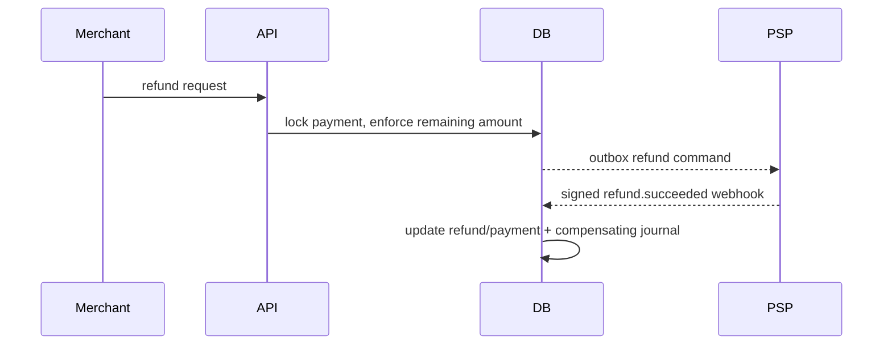

# Refunds and disputes

Status: current.

Refund creation locks the payment row and sums accepted/succeeded refunds. It rejects an amount that would exceed captured funds. The local request and provider outbox event commit together. Provider failure releases the pending amount; provider success increments `refunded_amount` and posts a compensating ledger journal. Multiple partial refunds are supported and idempotent.

A dispute open event records the case and moves merchant funds into dispute clearing. If the merchant wins, those entries are reversed. If the merchant loses, dispute clearing is released against platform cash. The original capture journal remains unchanged. This lab models a single dispute amount and final win/loss; it omits evidence file exchange, representment stages, network fees, and scheme deadlines.
