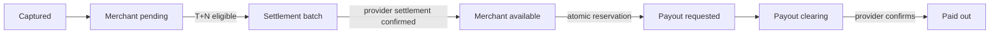

# Settlement and payout

Status: current.

The settlement generator selects captured, unsettled payment captures older than the merchant's configured delay. It creates a settlement and unique items in one transaction. Completion posts cash/clearing and pending/available movements using one ledger business reference. Retry finds the existing settlement journal.

On the Stripe learning branch this remains an internal accounting/availability model. It does not control or represent Stripe Balance Transactions, provider settlement, reserves, or bank payouts. Those would require a separate Stripe reporting/API adapter.

Payout requests take a transaction-scoped PostgreSQL advisory lock derived from `(merchant, currency)`, then calculate the available account balance from immutable entries and reserve it in the same transaction. Two concurrent requests cannot both observe and spend the same funds. The lock is cross-process and releases on commit/rollback; an in-process mutex would not protect multiple API replicas or workers.

Disputes may make a merchant liability negative. Payouts never do: only a positive currently available amount can be reserved.
