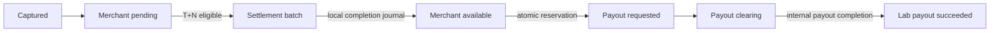

# Settlement and payout

Status: current.

[B2.4 settlement integration](audits/h1-fix-02-b2-4-settlement-integration.md) adds a separate dormant allocation-aware service. It is absent from production routes/jobs and shares the dormant refund/dispute protocol in direct PostgreSQL tests. Legacy generation/completion and pooled payout behavior below remain unchanged; no scope is ACTIVE and F01/F04 remain open pending B3 cutover. Earlier B2.2/B2.3 synthetic settlement fixtures remain setup evidence, distinct from the new actual service tests.

The settlement generator selects captured, unsettled payment captures older than the merchant's configured delay. It creates a settlement and unique items in one transaction. Completion posts cash/clearing and pending/available movements using one ledger business reference. Retry finds the existing settlement journal.

[B2.1](audits/h1-fix-02-b2-1-capture-integration.md) adds journal-backed original capture lots and frozen eligibility, but this generator/completer still uses legacy attempts, current merchant delay and original amounts. It does not read those lots or allocations. No scope is ACTIVE; F01's refunded/held-fund release defect remains unresolved. FOUNDATION_ONLY and REVIEW_REQUIRED do not quarantine current pooled available funds or block legacy settlement/payout. Full writer integration, live legacy reconciliation, exception admission and allocation-aware generation/completion must precede a reviewed forward activation migration.

On the Stripe learning branch this remains an internal accounting/availability model. It does not control or represent Stripe Balance Transactions, provider settlement, reserves, or bank payouts. Those would require a separate Stripe reporting/API adapter.

Payout requests take a transaction-scoped PostgreSQL advisory lock derived from `(merchant, currency)`, then calculate the available account balance from immutable entries and reserve it in the same transaction. Two concurrent requests cannot both observe and spend the same funds. The lock is cross-process and releases on commit/rollback; an in-process mutex would not protect multiple API replicas or workers.

Disputes may make a merchant liability negative. Payouts never do: only a positive currently available amount can be reserved.

[B2.2's dormant refund path](audits/h1-fix-02-b2-2-refund-integration.md) shares the payout advisory key in isolated PostgreSQL tests. A pending refund is only a gross-capacity reservation (approved Option A), so a payout may reserve funds first; later confirmed refund can leave signed available debt and insufficient internal cash. No payout cancellation, recovery or strict pending hold is implemented. This service is disconnected, legacy payout/refund admission is unchanged, and F04 remains open pending independent combined verification. Synthetic allocation-aware settlement fixtures in refund tests do not implement B2.4.

## Dormant allocation-aware settlement

CaptureSettlementAccountingService generates mature, verified NEW_CAPTURE candidates in independent scope transactions. It uses frozen eligibility and reconciled capture/refund/dispute history, refuses blocking exceptions/uncertain legacy evidence, and totals original gross/fee/net and estimated effects from actual inserted unique capture items. Generation creates no financial journal. Completion takes admission and a shared header before all payments/children/lots/allocations, rereads current effects and finalizes the entire batch atomically.

Asset transfer is original gross minus confirmed refunds/losses. Merchant release is max(original net minus confirmed refund net/losses/current OPEN funded holds,0). Positive effects post independent cash/PSP and pending/available pairs. Original fees and restricted dispute clearing remain separate. Full refunds can produce durable ZERO_EFFECT finalization without a journal. Stale estimates remain historical while actual final amounts and applied revisions are stored separately. Replay validates the saved immutable snapshot/journal, allowing later refunds/dispute outcomes without repeat settlement.

The service exposes generate(merchantId?,currency?) and complete(tx,id) for future coordinated callers; current completeForMerchant(), completeDue(), controller/listing and settlement-poll remain legacy. Future routing must authorize merchant ownership, distinguish policies and commit exception dispositions. Existing grossAmount/feeAmount/netAmount retain original meanings; future estimated/final asset transfer and release should be distinct exact minor-unit string fields with result/journal/timestamps. No API or dashboard semantics change in this checkpoint.

The [73 PostgreSQL cases](../apps/api/test/integration/settlement-accounting-integration.spec.ts) assert account-level normal/refund/hold/win/loss/mixed/zero results, rollback, uniqueness, saved replay and observed two-order races with actual dormant writers. They do not verify full signed runtime dispatch, unknown/late inbox admission, old-worker drain or F04 payout safety. REVIEW_REQUIRED still does not quarantine legacy pooled funds. Reconciled history, exception admission, coordinated dispatch/drain, a reviewed forward ACTIVE migration and B3 accounting/race/rollback verification must precede live cutover. Internal cash movements do not mean Stripe transferred funds.
