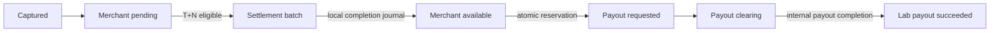

# Settlement and payout

Status: current.

The settlement generator selects captured, unsettled payment captures older than the merchant's configured delay. It creates a settlement and unique items in one transaction. Completion posts cash/clearing and pending/available movements using one ledger business reference. Retry finds the existing settlement journal.

[B2.1](audits/h1-fix-02-b2-1-capture-integration.md) adds journal-backed original capture lots and frozen eligibility, but this generator/completer still uses legacy attempts, current merchant delay and original amounts. It does not read those lots or allocations. No scope is ACTIVE; F01's refunded/held-fund release defect remains unresolved. FOUNDATION_ONLY and REVIEW_REQUIRED do not quarantine current pooled available funds or block legacy settlement/payout. Full writer integration, live legacy reconciliation, exception admission and allocation-aware generation/completion must precede a reviewed forward activation migration.

On the Stripe learning branch this remains an internal accounting/availability model. It does not control or represent Stripe Balance Transactions, provider settlement, reserves, or bank payouts. Those would require a separate Stripe reporting/API adapter.

Payout requests take a transaction-scoped PostgreSQL advisory lock derived from `(merchant, currency)`, then calculate the available account balance from immutable entries and reserve it in the same transaction. Two concurrent requests cannot both observe and spend the same funds. The lock is cross-process and releases on commit/rollback; an in-process mutex would not protect multiple API replicas or workers.

Disputes may make a merchant liability negative. Payouts never do: only a positive currently available amount can be reserved.

[B2.2's dormant refund path](audits/h1-fix-02-b2-2-refund-integration.md) shares the payout advisory key in isolated PostgreSQL tests. A pending refund is only a gross-capacity reservation (approved Option A), so a payout may reserve funds first; later confirmed refund can leave signed available debt and insufficient internal cash. No payout cancellation, recovery or strict pending hold is implemented. This service is disconnected, legacy payout/refund admission is unchanged, and F04 remains open pending independent combined verification. Synthetic allocation-aware settlement fixtures in refund tests do not implement B2.4.
